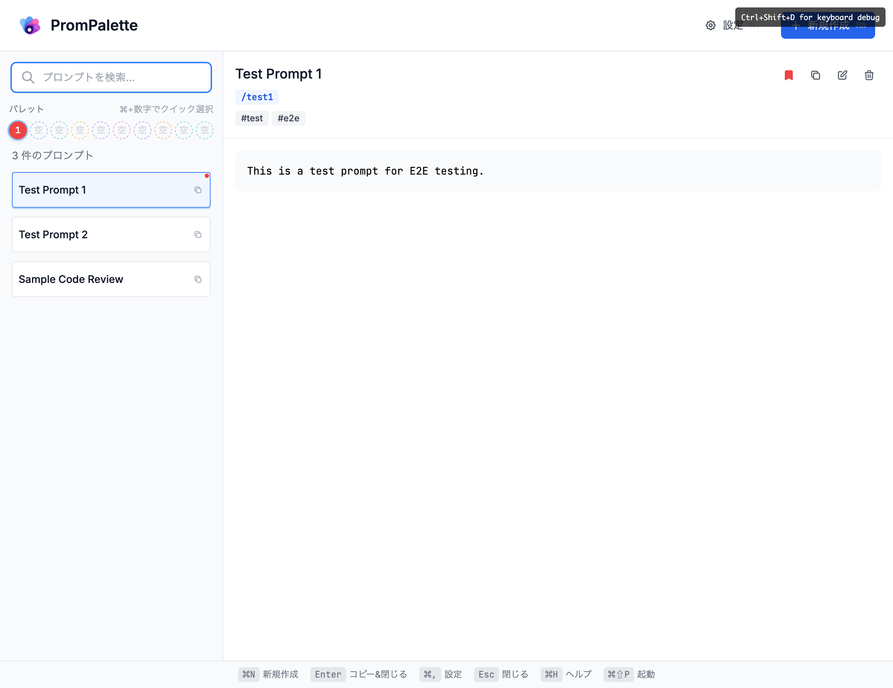
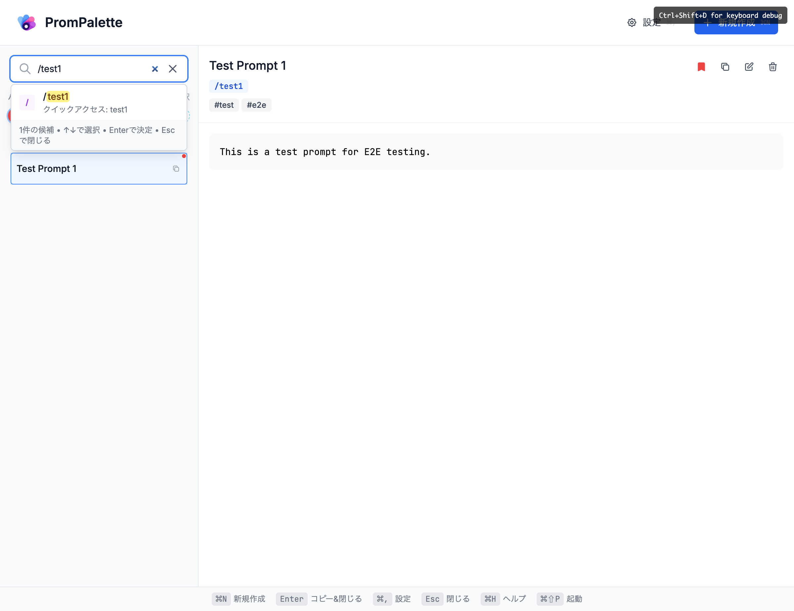

# 🎨 PromPalette

<div align="center">
  <h3 align="center">Your AI Prompts, Beautifully Organized</h3>
  
  <p align="center">
    A desktop application for managing and organizing your AI prompts locally
    <br />
    <a href="https://github.com/Jun-T-git/prompalette/issues">Report Bug</a>
    ·
    <a href="https://github.com/Jun-T-git/prompalette/issues">Request Feature</a>
  </p>
  
  [](./LICENSE)
</div>

## 📷 Screenshots

<div align="center">
  
  <p><em>Main interface showing prompt management, palette system, and keyboard shortcuts</em></p>
</div>

<div align="center">
  
  <p><em>Create new prompts with title, content, tags, and quick-access keys</em></p>
</div>

<div align="center">
  
  <p><em>Instant search with tag filtering (#tag) and smart autocomplete</em></p>
</div>

<div align="center">
  
  <p><em>Direct prompt access using quick-access keys (/key) for immediate results</em></p>
</div>

## ✨ Features

- 🚀 **Global Hotkeys** - System-wide access with Cmd+Ctrl+1-9,0 (macOS) / Ctrl+Ctrl+1-9,0 (Windows/Linux)
- 💾 **Local-First Storage** - SQLite database with offline-first approach  
- 🏷️ **Advanced Search** - Text, tag (#tag), and quick-access (/key) search with smart scoring
- 📌 **Pin System** - 10 pinnable positions with global hotkey integration
- 🎯 **Flexible Titles** - Optional title support with content-based fallbacks
- ⌨️ **Full Keyboard Nav** - Context-aware shortcuts (⌘N, ⌘E, ⌘F, etc.)

## 🚀 Quick Start

### Development Setup

1. **Install Prerequisites**
   ```bash
   # Install Rust (required for native app)
   curl --proto '=https' --tlsv1.2 -sSf https://sh.rustup.rs | sh
   
   # Install Node.js 20+ and pnpm 8+
   # (via nvm, homebrew, or package manager)
   ```

2. **Clone and Setup**
   ```bash
   git clone https://github.com/Jun-T-git/prompalette.git
   cd prompalette
   pnpm install
   ```

3. **Run Development**
   ```bash
   cd apps/native
   pnpm dev            # Development environment
   pnpm dev:staging    # Staging environment (optional)
   ```

### Building for Production

```bash
cd apps/native
pnpm build
```

This will create a distributable DMG file for macOS.

### Distribution Notes

**⚠️ Security Considerations**:

- **macOS**: Unsigned builds require users to right-click → "Open" and bypass Gatekeeper warnings
- **Windows**: May trigger SmartScreen warnings for unsigned executables  
- **Linux**: Generally no restrictions, but some distributions may require additional permissions

For production distribution, platform-specific code signing is recommended.

## 📋 System Requirements

### Supported Platforms
- **macOS**: 10.15 or later (primary target)
- **Windows**: 10 or later (development support)
- **Linux**: Modern distributions (development support)

### Development Requirements
- **Node.js**: 20 or later  
- **pnpm**: 8 or later
- **Rust**: 1.77 or later (Tauri 2.0 requirement)

## 💻 Development

### Project Structure

```
prompalette/
├── apps/
│   ├── native/      # Desktop app (Tauri + React)
│   ├── api/         # REST API (Hono)
│   └── web/         # Web interface (Next.js)
├── packages/
│   ├── core/        # Shared business logic & validation
│   ├── ui/          # Shared UI components
│   └── api-client/  # API client library
```

### Available Scripts

```bash
# Development
pnpm dev            # Start all development servers
pnpm test           # Run all tests
pnpm typecheck      # Type check all packages
pnpm lint           # Lint all packages
pnpm build          # Build all packages

# Native app specific
cd apps/native
pnpm dev                    # Start native app in development
pnpm dev:staging           # Start native app in staging
pnpm tauri:build:dev       # Build development version
pnpm tauri:build:staging   # Build staging version
pnpm tauri:build:production # Build production version
```

## 🤝 Contributing

We welcome contributions! Please see our [Contributing Guide](CONTRIBUTING.md) for details.

## 📄 License

Distributed under the MIT License. See [LICENSE](LICENSE) for more information.

## 🙏 Acknowledgments

- [Tauri](https://tauri.app/) - For the native app framework
- [React](https://reactjs.org/) - For the UI framework
- [Tailwind CSS](https://tailwindcss.com/) - For styling
- [Zustand](https://zustand-demo.pmnd.rs/) - For state management
