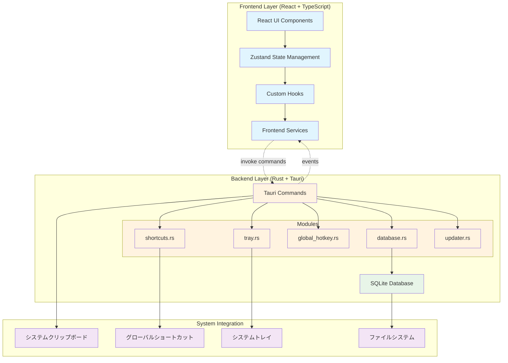
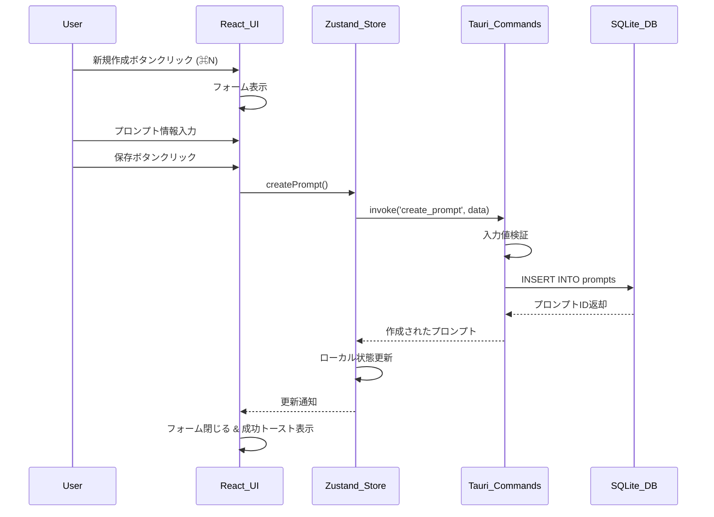
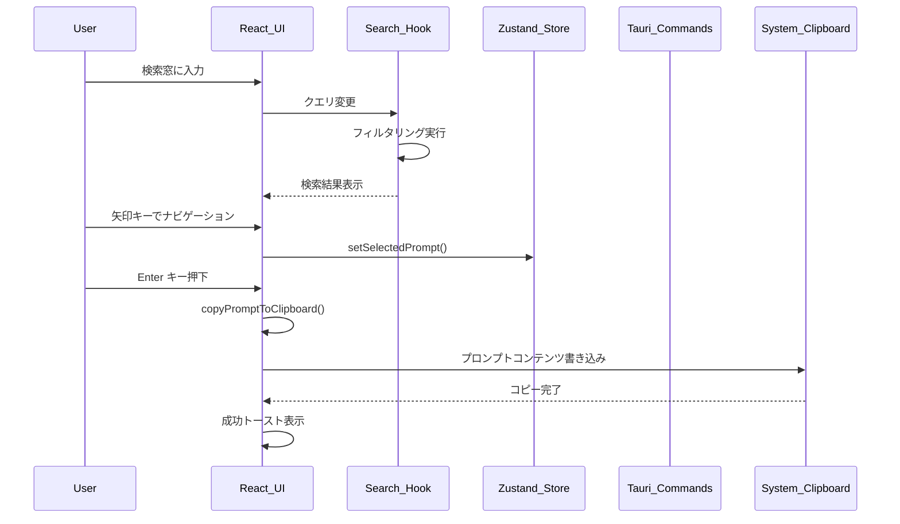
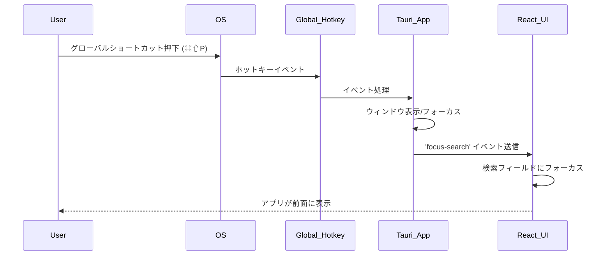
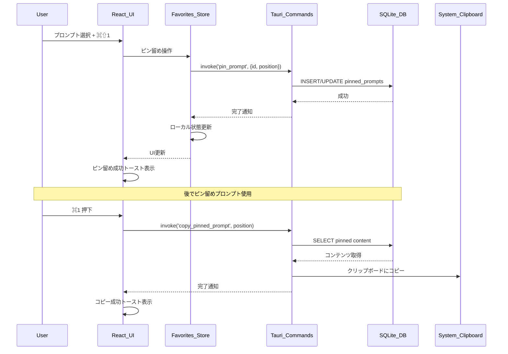

# PromPalette Native App - アーキテクチャ & シーケンス図

## 📋 概要

PromPalette Native Appは **Tauri + React + SQLite** アーキテクチャを採用したデスクトップアプリケーションです。
このドキュメントでは、アプリケーションの全体構造と主要な処理フローをMermaid記法で可視化しています。

## 🏗️ アーキテクチャ図

### 🔧 技術スタック詳細

| レイヤー | 技術 | 説明 |
|---------|------|------|
| **Frontend** | React 18 + TypeScript | ユーザーインターフェース |
| **State Management** | Zustand | 軽量な状態管理 |
| **Native Shell** | Tauri 2.0 | Rustベースのネイティブフレームワーク |
| **Backend** | Rust | 高性能なバックエンド処理 |
| **Database** | SQLite + sqlx | ローカルデータベース |
| **Build** | Vite | 高速なフロントエンドビルド |
| **Testing** | Vitest + React Testing Library | テストフレームワーク |

## 📋 シーケンス図

### 1. プロンプト作成フロー

### 2. プロンプト検索・選択・コピーフロー

### 3. グローバルショートカット起動フロー

### 4. ピン留めプロンプト操作フロー

## 🎯 設計特徴

### ローカルファーストアプローチ
- **高速検索**: SQLiteによる<5ms検索レスポンス
- **オフライン完結**: ネットワーク接続不要
- **軽量設計**: メモリ使用量<20MB、バイナリサイズ<20MB

### パフォーマンス最適化
- **非同期処理**: Rustの非同期ランタイムによる高速処理
- **効率的な状態管理**: Zustandによる軽量状態管理
- **リアルタイム検索**: フロントエンドでの高速フィルタリング

### システム統合
- **グローバルホットキー**: OS全体からの瞬時アクセス
- **クリップボード統合**: シームレスなコピー&ペースト
- **システムトレイ**: バックグラウンド常駐機能

## 🔗 関連ドキュメント

- [ARCHITECTURE.md](../apps/native/ARCHITECTURE.md) - 詳細なアーキテクチャ決定書
- [README.md](../apps/native/README.md) - セットアップと使用方法
- [Tauri公式ドキュメント](https://tauri.app/) - Tauriフレームワーク詳細

---

**作成日**: 2025-01-13  
**更新者**: Claude Code