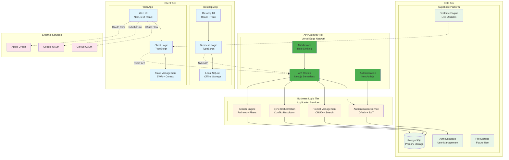
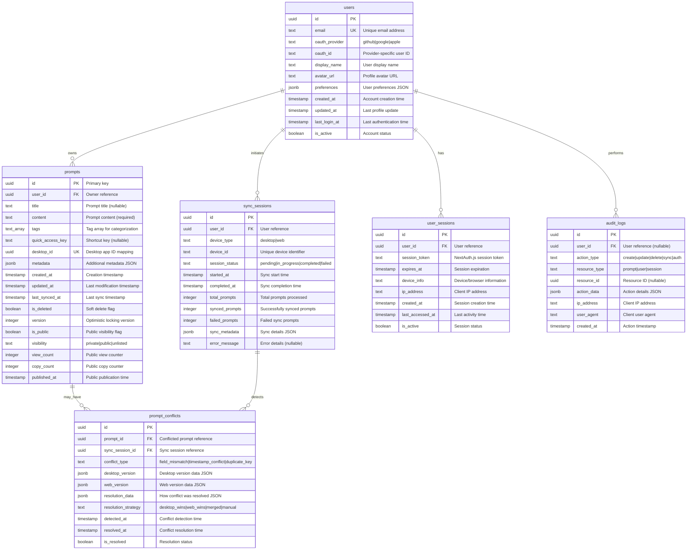

# PromPalette Web App - 詳細システム設計書

**📅 設計日**: 2025-01-13  
**🏗️ システムアーキテクト**: Claude Code  
**🎯 対象**: Tier 0（完全無料構成）Web App MVP  
**⚡ 技術構成**: Next.js 14 + Supabase + Vercel

---

## 🏛️ システムアーキテクチャ設計

### **アーキテクチャ原則**

#### **1. 完全無料運用の原則**
- Vercel無料プラン制限内での最適化
- Supabase無料プラン効率活用
- コスト発生ポイント完全排除

#### **2. Desktop体験統一の原則**
- 技術スタック完全統一（React/TypeScript）
- データ構造100%互換性
- UI/UX完全一貫性

#### **3. スケーラビリティの原則**
- 段階的拡張可能設計
- マイクロサービス準備設計
- キャッシュ戦略内包

#### **4. セキュリティファーストの原則**
- OAuth 2.0標準準拠
- データ暗号化標準
- CSRF/XSS完全対策

### **システム全体構成**



### **技術スタック詳細**

#### **Frontend Layer**
```typescript
// Core Framework
- Next.js 14.0+ (App Router)
- React 18.0+ (Server Components + Client Components)
- TypeScript 5.0+ (Strict Mode)

// State Management
- SWR 2.0+ (Data Fetching + Caching)
- React Context (Authentication State)
- Zustand 4.0+ (Complex State, if needed)

// Styling & UI
- Tailwind CSS 3.0+ (Utility-First)
- Headless UI (Accessible Components)
- Lucide React (Icons)
- Framer Motion (Animations)

// Development Tools
- ESLint + Prettier (Code Quality)
- TypeScript Strict Mode
- Jest + Testing Library (Testing)
```

#### **Backend Layer**
```typescript
// API Framework
- Next.js API Routes (Serverless Functions)
- Vercel Edge Runtime (Global Distribution)

// Authentication
- NextAuth.js 4.0+ (OAuth + JWT)
- @auth/supabase-adapter (Database Integration)

// Database
- Supabase Client (PostgreSQL Interface)
- Prisma 5.0+ (Type-safe Database Access, Optional)

// Validation & Security
- Zod (Runtime Type Validation)
- CORS Middleware
- Rate Limiting (Vercel Edge)
```

#### **Infrastructure Layer**
```yaml
# Hosting & Deployment
Vercel:
  plan: Free
  features:
    - 100GB Bandwidth
    - 100GB-hours Function Execution
    - Custom Domains
    - SSL Certificates
    - Preview Deployments

# Database & Auth
Supabase:
  plan: Free
  features:
    - 500MB Database Storage
    - 50,000 Monthly Active Users
    - Realtime subscriptions
    - Row Level Security
```

---

## 🗄️ データベース設計

### **データベーススキーマ設計**

#### **論理データモデル**



#### **物理データベース実装**

```sql
-- ==========================================
-- Database: PromPalette Web App
-- Version: 1.0
-- Platform: Supabase PostgreSQL
-- ==========================================

-- Enable required extensions
CREATE EXTENSION IF NOT EXISTS "uuid-ossp";
CREATE EXTENSION IF NOT EXISTS "pgcrypto";

-- ==========================================
-- Core Tables
-- ==========================================

-- Users table with comprehensive profile management
CREATE TABLE users (
    id UUID PRIMARY KEY DEFAULT uuid_generate_v4(),
    email TEXT UNIQUE NOT NULL,
    oauth_provider TEXT NOT NULL CHECK (oauth_provider IN ('github', 'google', 'apple')),
    oauth_id TEXT NOT NULL,
    display_name TEXT,
    avatar_url TEXT,
    preferences JSONB DEFAULT '{}',
    created_at TIMESTAMP WITH TIME ZONE DEFAULT NOW(),
    updated_at TIMESTAMP WITH TIME ZONE DEFAULT NOW(),
    last_login_at TIMESTAMP WITH TIME ZONE,
    is_active BOOLEAN DEFAULT true,
    
    -- Composite unique constraint for OAuth identity
    UNIQUE(oauth_provider, oauth_id)
);

-- Prompts table with full Desktop compatibility + Public sharing
CREATE TABLE prompts (
    id UUID PRIMARY KEY DEFAULT uuid_generate_v4(),
    user_id UUID NOT NULL REFERENCES users(id) ON DELETE CASCADE,
    title TEXT,
    content TEXT NOT NULL,
    tags TEXT[] DEFAULT ARRAY[]::TEXT[],
    quick_access_key TEXT,
    desktop_id TEXT UNIQUE, -- Desktop app ID mapping
    metadata JSONB DEFAULT '{}',
    created_at TIMESTAMP WITH TIME ZONE DEFAULT NOW(),
    updated_at TIMESTAMP WITH TIME ZONE DEFAULT NOW(),
    last_synced_at TIMESTAMP WITH TIME ZONE,
    is_deleted BOOLEAN DEFAULT false,
    version INTEGER DEFAULT 1,
    
    -- Public sharing fields
    is_public BOOLEAN DEFAULT true,
    visibility TEXT DEFAULT 'public' CHECK (visibility IN ('private', 'public', 'unlisted')),
    view_count INTEGER DEFAULT 0,
    copy_count INTEGER DEFAULT 0,
    published_at TIMESTAMP WITH TIME ZONE,
    
    -- Constraints
    CONSTRAINT prompts_title_length CHECK (char_length(title) <= 200),
    CONSTRAINT prompts_content_length CHECK (char_length(content) <= 100000),
    CONSTRAINT prompts_content_not_empty CHECK (char_length(trim(content)) > 0),
    CONSTRAINT prompts_quick_access_key_format CHECK (
        quick_access_key IS NULL OR 
        (char_length(quick_access_key) BETWEEN 2 AND 20 AND quick_access_key ~ '^[a-zA-Z0-9]+$')
    ),
    CONSTRAINT prompts_tags_count CHECK (array_length(tags, 1) IS NULL OR array_length(tags, 1) <= 10),
    CONSTRAINT prompts_public_consistency CHECK (
        (is_public = false AND visibility = 'private') OR
        (is_public = true AND visibility IN ('public', 'unlisted'))
    ),
    CONSTRAINT prompts_published_consistency CHECK (
        (is_public = false AND published_at IS NULL) OR
        (is_public = true AND published_at IS NOT NULL)
    )
);

-- Sync sessions for tracking synchronization operations
CREATE TABLE sync_sessions (
    id UUID PRIMARY KEY DEFAULT uuid_generate_v4(),
    user_id UUID NOT NULL REFERENCES users(id) ON DELETE CASCADE,
    device_type TEXT NOT NULL CHECK (device_type IN ('desktop', 'web')),
    device_id TEXT NOT NULL,
    session_status TEXT DEFAULT 'pending' CHECK (session_status IN ('pending', 'in_progress', 'completed', 'failed')),
    started_at TIMESTAMP WITH TIME ZONE DEFAULT NOW(),
    completed_at TIMESTAMP WITH TIME ZONE,
    total_prompts INTEGER DEFAULT 0,
    synced_prompts INTEGER DEFAULT 0,
    failed_prompts INTEGER DEFAULT 0,
    sync_metadata JSONB DEFAULT '{}',
    error_message TEXT
);

-- Conflict resolution tracking
CREATE TABLE prompt_conflicts (
    id UUID PRIMARY KEY DEFAULT uuid_generate_v4(),
    prompt_id UUID REFERENCES prompts(id) ON DELETE CASCADE,
    sync_session_id UUID REFERENCES sync_sessions(id) ON DELETE CASCADE,
    conflict_type TEXT NOT NULL CHECK (conflict_type IN ('field_mismatch', 'timestamp_conflict', 'duplicate_key')),
    desktop_version JSONB NOT NULL,
    web_version JSONB NOT NULL,
    resolution_data JSONB DEFAULT '{}',
    resolution_strategy TEXT CHECK (resolution_strategy IN ('desktop_wins', 'web_wins', 'merged', 'manual')),
    detected_at TIMESTAMP WITH TIME ZONE DEFAULT NOW(),
    resolved_at TIMESTAMP WITH TIME ZONE,
    is_resolved BOOLEAN DEFAULT false
);

-- User sessions for NextAuth.js integration
CREATE TABLE user_sessions (
    id UUID PRIMARY KEY DEFAULT uuid_generate_v4(),
    user_id UUID NOT NULL REFERENCES users(id) ON DELETE CASCADE,
    session_token TEXT UNIQUE NOT NULL,
    expires_at TIMESTAMP WITH TIME ZONE NOT NULL,
    device_info TEXT,
    ip_address INET,
    created_at TIMESTAMP WITH TIME ZONE DEFAULT NOW(),
    last_accessed_at TIMESTAMP WITH TIME ZONE DEFAULT NOW(),
    is_active BOOLEAN DEFAULT true
);

-- Audit logging for security and debugging
CREATE TABLE audit_logs (
    id UUID PRIMARY KEY DEFAULT uuid_generate_v4(),
    user_id UUID REFERENCES users(id) ON DELETE SET NULL,
    action_type TEXT NOT NULL CHECK (action_type IN ('create', 'update', 'delete', 'sync', 'auth')),
    resource_type TEXT NOT NULL CHECK (resource_type IN ('prompt', 'user', 'session')),
    resource_id UUID,
    action_data JSONB DEFAULT '{}',
    ip_address INET,
    user_agent TEXT,
    created_at TIMESTAMP WITH TIME ZONE DEFAULT NOW()
);


-- ==========================================
-- Indexes for Performance Optimization
-- ==========================================

-- Users indexes
CREATE INDEX idx_users_email ON users(email);
CREATE INDEX idx_users_oauth ON users(oauth_provider, oauth_id);
CREATE INDEX idx_users_active ON users(is_active) WHERE is_active = true;

-- Prompts indexes
CREATE INDEX idx_prompts_user_id ON prompts(user_id);
CREATE INDEX idx_prompts_desktop_id ON prompts(desktop_id) WHERE desktop_id IS NOT NULL;
CREATE INDEX idx_prompts_updated_at ON prompts(updated_at);
CREATE INDEX idx_prompts_created_at ON prompts(created_at);
CREATE INDEX idx_prompts_quick_access_key ON prompts(quick_access_key) WHERE quick_access_key IS NOT NULL;
CREATE INDEX idx_prompts_active ON prompts(user_id, is_deleted) WHERE is_deleted = false;

-- Full-text search indexes
CREATE INDEX idx_prompts_title_search ON prompts USING GIN(to_tsvector('english', coalesce(title, ''))) WHERE is_deleted = false;
CREATE INDEX idx_prompts_content_search ON prompts USING GIN(to_tsvector('english', content)) WHERE is_deleted = false;
CREATE INDEX idx_prompts_tags_search ON prompts USING GIN(tags) WHERE is_deleted = false;

-- Sync sessions indexes
CREATE INDEX idx_sync_sessions_user_id ON sync_sessions(user_id);
CREATE INDEX idx_sync_sessions_device ON sync_sessions(device_type, device_id);
CREATE INDEX idx_sync_sessions_status ON sync_sessions(session_status);
CREATE INDEX idx_sync_sessions_started_at ON sync_sessions(started_at);

-- Audit logs indexes
CREATE INDEX idx_audit_logs_user_id ON audit_logs(user_id);
CREATE INDEX idx_audit_logs_action_type ON audit_logs(action_type);
CREATE INDEX idx_audit_logs_created_at ON audit_logs(created_at);

-- ==========================================
-- Database Functions and Triggers
-- ==========================================

-- Function to update updated_at timestamp
CREATE OR REPLACE FUNCTION update_updated_at_column()
RETURNS TRIGGER AS $$
BEGIN
    NEW.updated_at = NOW();
    RETURN NEW;
END;
$$ language 'plpgsql';

-- Triggers for automatic timestamp updates
CREATE TRIGGER update_users_updated_at BEFORE UPDATE ON users
    FOR EACH ROW EXECUTE FUNCTION update_updated_at_column();

CREATE TRIGGER update_prompts_updated_at BEFORE UPDATE ON prompts
    FOR EACH ROW EXECUTE FUNCTION update_updated_at_column();

-- Function for prompt versioning
CREATE OR REPLACE FUNCTION increment_prompt_version()
RETURNS TRIGGER AS $$
BEGIN
    IF OLD.content IS DISTINCT FROM NEW.content OR 
       OLD.title IS DISTINCT FROM NEW.title OR 
       OLD.tags IS DISTINCT FROM NEW.tags THEN
        NEW.version = OLD.version + 1;
    END IF;
    RETURN NEW;
END;
$$ language 'plpgsql';

CREATE TRIGGER increment_prompt_version_trigger BEFORE UPDATE ON prompts
    FOR EACH ROW EXECUTE FUNCTION increment_prompt_version();

-- ==========================================
-- Row Level Security (RLS)
-- ==========================================

-- Enable RLS on all tables
ALTER TABLE users ENABLE ROW LEVEL SECURITY;
ALTER TABLE prompts ENABLE ROW LEVEL SECURITY;
ALTER TABLE sync_sessions ENABLE ROW LEVEL SECURITY;
ALTER TABLE prompt_conflicts ENABLE ROW LEVEL SECURITY;
ALTER TABLE user_sessions ENABLE ROW LEVEL SECURITY;
ALTER TABLE audit_logs ENABLE ROW LEVEL SECURITY;

-- Users can only access their own data
CREATE POLICY "Users can view own profile" ON users
    FOR SELECT USING (auth.uid()::text = id::text);

CREATE POLICY "Users can update own profile" ON users
    FOR UPDATE USING (auth.uid()::text = id::text);

-- Prompts access policies (updated for public sharing)
CREATE POLICY "Users can view own prompts" ON prompts
    FOR SELECT USING (auth.uid()::text = user_id::text AND is_deleted = false);

CREATE POLICY "Anyone can view public prompts" ON prompts
    FOR SELECT USING (is_public = true AND visibility = 'public' AND is_deleted = false);

CREATE POLICY "Users can insert own prompts" ON prompts
    FOR INSERT WITH CHECK (auth.uid()::text = user_id::text);

CREATE POLICY "Users can update own prompts" ON prompts
    FOR UPDATE USING (auth.uid()::text = user_id::text);

CREATE POLICY "Users can delete own prompts" ON prompts
    FOR DELETE USING (auth.uid()::text = user_id::text);

-- Sync sessions policies
CREATE POLICY "Users can view own sync sessions" ON sync_sessions
    FOR SELECT USING (auth.uid()::text = user_id::text);

CREATE POLICY "Users can insert own sync sessions" ON sync_sessions
    FOR INSERT WITH CHECK (auth.uid()::text = user_id::text);

CREATE POLICY "Users can update own sync sessions" ON sync_sessions
    FOR UPDATE USING (auth.uid()::text = user_id::text);

-- ==========================================
-- Initial Data and Configuration
-- ==========================================

-- Create initial admin user (optional)
-- INSERT INTO users (email, oauth_provider, oauth_id, display_name, is_active)
-- VALUES ('admin@prompalette.dev', 'github', 'admin', 'System Admin', true);
```

### **データベース最適化戦略**

#### **パフォーマンス最適化**
```sql
-- 検索パフォーマンス向上のための追加インデックス
CREATE INDEX CONCURRENTLY idx_prompts_compound_search 
ON prompts(user_id, is_deleted, updated_at DESC) 
WHERE is_deleted = false;

-- 統計情報更新の自動化
CREATE OR REPLACE FUNCTION update_table_statistics()
RETURNS void AS $$
BEGIN
    ANALYZE users;
    ANALYZE prompts;
    ANALYZE sync_sessions;
END;
$$ LANGUAGE plpgsql;

-- 定期実行のためのスケジュール（Supabase Edge Functions使用）
-- SELECT cron.schedule('update-stats', '0 2 * * *', 'SELECT update_table_statistics();');
```

#### **容量管理戦略**
```sql
-- 古いauditsログのクリーンアップ（30日以上）
CREATE OR REPLACE FUNCTION cleanup_old_audit_logs()
RETURNS void AS $$
BEGIN
    DELETE FROM audit_logs 
    WHERE created_at < NOW() - INTERVAL '30 days';
END;
$$ LANGUAGE plpgsql;

-- 完了済み同期セッションのクリーンアップ（7日以上）
CREATE OR REPLACE FUNCTION cleanup_old_sync_sessions()
RETURNS void AS $$
BEGIN
    DELETE FROM sync_sessions 
    WHERE session_status = 'completed' 
    AND completed_at < NOW() - INTERVAL '7 days';
END;
$$ LANGUAGE plpgsql;
```

---

## 🔌 API設計

### **API アーキテクチャ**

#### **RESTful API 設計原則**
- **Resource-Oriented**: エンティティベースのURL設計
- **HTTP Semantics**: 適切なHTTPメソッド・ステータスコード使用
- **Stateless**: ステートレス設計
- **Cacheable**: キャッシュ戦略内包
- **Layered**: レイヤード・アーキテクチャ

#### **API 命名規則**
```
/api/{version}/{resource}/{id?}/{action?}

例:
- GET /api/v1/prompts
- POST /api/v1/prompts
- PUT /api/v1/prompts/123e4567-e89b-12d3-a456-426614174000
- DELETE /api/v1/prompts/123e4567-e89b-12d3-a456-426614174000
- POST /api/v1/sync/upload
```

### **API エンドポイント詳細設計**

#### **認証関連API**

```typescript
// ==========================================
// Authentication APIs
// ==========================================

/**
 * OAuth認証開始
 * NextAuth.js標準エンドポイント使用
 */
GET /api/auth/signin/{provider}
// Providers: github, google, apple

/**
 * 認証コールバック
 * NextAuth.js標準処理
 */
GET /api/auth/callback/{provider}

/**
 * 現在のユーザー情報取得
 */
GET /api/auth/session
Response: {
  user?: {
    id: string;
    email: string;
    name: string;
    image: string;
  };
  expires: string;
}

/**
 * ログアウト
 */
POST /api/auth/signout
```

#### **プロンプト管理API**

```typescript
// ==========================================
// Prompt Management APIs
// ==========================================

/**
 * プロンプト一覧取得
 */
GET /api/v1/prompts
Query Parameters:
  - page?: number = 1 (ページ番号)
  - limit?: number = 20 (1ページあたりの件数, max: 100)
  - search?: string (検索クエリ)
  - tags?: string[] (タグフィルタ)
  - sort?: 'created_at' | 'updated_at' | 'title' = 'updated_at'
  - order?: 'asc' | 'desc' = 'desc'
  - include_deleted?: boolean = false (削除済み含む)

Response: {
  prompts: Prompt[];
  pagination: {
    page: number;
    limit: number;
    total: number;
    totalPages: number;
    hasNext: boolean;
    hasPrev: boolean;
  };
  filters: {
    search?: string;
    tags: string[];
    appliedFilters: number;
  };
}

/**
 * プロンプト詳細取得
 */
GET /api/v1/prompts/{id}
Response: {
  prompt: Prompt;
  related?: Prompt[]; // 関連プロンプト（タグベース）
}

/**
 * プロンプト作成
 */
POST /api/v1/prompts
Request Body: {
  title?: string; // max: 200文字
  content: string; // required, max: 100,000文字
  tags?: string[]; // max: 10個
  quickAccessKey?: string; // 英数字2-20文字
  metadata?: Record<string, unknown>;
}
Response: {
  prompt: Prompt;
  created: true;
}

/**
 * プロンプト更新
 */
PUT /api/v1/prompts/{id}
Request Body: Partial<CreatePromptRequest> & {
  version?: number; // Optimistic locking
}
Response: {
  prompt: Prompt;
  updated: true;
  conflictResolution?: ConflictResolution;
}

/**
 * プロンプト削除（ソフトデリート）
 */
DELETE /api/v1/prompts/{id}
Response: {
  deleted: true;
  deletedAt: string;
}

/**
 * プロンプト完全削除
 */
DELETE /api/v1/prompts/{id}/permanent
Response: {
  permanentlyDeleted: true;
}

/**
 * プロンプト復元
 */
POST /api/v1/prompts/{id}/restore
Response: {
  prompt: Prompt;
  restored: true;
}
```

#### **検索API**

```typescript
// ==========================================
// Search APIs
// ==========================================

/**
 * 高度検索（個人 + 公開プロンプト）
 */
GET /api/v1/search
Query Parameters:
  - q: string (検索クエリ, required)
    検索構文:
    - "code review" - 通常検索
    - "#productivity" - タグ検索
    - "/quickkey" - クイックアクセスキー検索
    - "@username" - 特定ユーザーのプロンプト検索
    - "@username /quickkey" - ユーザー+キーで一意特定
  - scope?: 'all' | 'mine' | 'public' = 'all'
  - type?: 'all' | 'title' | 'content' | 'tags' | 'quick_key' = 'all'
  - tags?: string[] (タグフィルタ)
  - date_from?: string (作成日フィルタ開始)
  - date_to?: string (作成日フィルタ終了)
  - page?: number = 1
  - limit?: number = 20
  - highlight?: boolean = true (検索結果ハイライト)
  - sort?: 'relevance' | 'created_at' | 'updated_at' | 'popularity' = 'relevance'

Response: {
  results: SearchResult[];
  pagination: PaginationInfo;
  searchInfo: {
    query: string;
    parsedQuery: {
      text?: string;
      tags?: string[];
      quickAccessKey?: string;
      username?: string;
      isUserSpecific: boolean;
    };
    scope: 'all' | 'mine' | 'public';
    totalResults: number;
    executionTime: number;
  };
  facets: {
    tags: { name: string; count: number }[];
    users: { username: string; displayName: string; count: number }[];
    dates: { period: string; count: number }[];
  };
}

interface SearchResult {
  id: string;
  title: string | null;
  content: string;
  contentPreview: string; // 最初の200文字
  tags: string[];
  quickAccessKey: string | null;
  author: {
    id: string;
    displayName: string;
    avatarUrl?: string;
  };
  isOwner: boolean; // 検索者がオーナーかどうか
  visibility: 'private' | 'public';
  highlights: {
    title?: string[];
    content?: string[];
    tags?: string[];
  };
  stats: {
    viewCount: number;
    copyCount: number;
  };
  createdAt: string;
  updatedAt: string;
  relevanceScore: number;
}

/**
 * 公開プロンプト検索（認証不要）
 */
GET /api/v1/public/search
Query Parameters: （上記と同様、ただしscope='public'固定）

/**
 * ユーザー検索（@username補完用）
 */
GET /api/v1/users/search
Query Parameters:
  - q: string (ユーザー名部分一致)
  - limit?: number = 10

Response: {
  users: {
    id: string;
    displayName: string;
    avatarUrl?: string;
    publicPromptCount: number;
  }[];
}

/**
 * 人気タグ取得
 */
GET /api/v1/tags/popular
Query Parameters:
  - scope?: 'mine' | 'public' = 'public'
  - limit?: number = 20

Response: {
  tags: {
    name: string;
    count: number;
    trend: 'up' | 'down' | 'stable';
  }[];
}

/**
 * 検索候補取得
 */
GET /api/v1/search/suggestions
Query Parameters:
  - q: string (部分入力)
  - type?: 'tags' | 'titles' | 'quick_keys' | 'users' = 'tags'
  - limit?: number = 10

Response: {
  suggestions: string[];
  type: string;
}

/**
 * 人気検索クエリ
 */
GET /api/v1/search/popular
Response: {
  queries: string[];
  tags: string[];
  timeframe: string;
}
```


#### **同期API**（低優先度）

```typescript
// ==========================================
// Synchronization APIs
// ==========================================

/**
 * 同期セッション開始
 */
POST /api/v1/sync/sessions
Request Body: {
  deviceType: 'desktop' | 'web';
  deviceId: string;
  clientVersion: string;
  syncStrategy?: 'full' | 'incremental' = 'incremental';
}
Response: {
  sessionId: string;
  syncToken: string;
  serverTime: string;
  conflictResolutionStrategy: string;
}

/**
 * Desktop → Web アップロード
 */
POST /api/v1/sync/upload
Request Body: {
  sessionId: string;
  prompts: DesktopPromptUpload[];
  lastSyncTime?: string;
  deleteIds?: string[]; // 削除されたプロンプトID
}
Response: {
  processed: number;
  created: number;
  updated: number;
  conflicts: number;
  errors: SyncError[];
  conflictResolutions: ConflictResolution[];
  newSyncTime: string;
}

/**
 * Web → Desktop ダウンロード
 */
GET /api/v1/sync/download
Query Parameters:
  - sessionId: string
  - lastSyncTime?: string
  - includeDeleted?: boolean = false

Response: {
  prompts: WebPromptDownload[];
  deletedIds: string[];
  syncTime: string;
  hasMore: boolean;
  nextPageToken?: string;
}

/**
 * 同期ステータス更新
 */
PUT /api/v1/sync/sessions/{sessionId}
Request Body: {
  status: 'completed' | 'failed' | 'cancelled';
  processedCount?: number;
  errorMessage?: string;
  clientTime: string;
}
Response: {
  updated: true;
  finalStatus: string;
}

/**
 * 競合解決
 */
POST /api/v1/sync/conflicts/{conflictId}/resolve
Request Body: {
  strategy: 'desktop_wins' | 'web_wins' | 'merged';
  mergedData?: Partial<Prompt>;
  userChoice: boolean;
}
Response: {
  resolved: true;
  finalPrompt: Prompt;
  appliedStrategy: string;
}

/**
 * 同期履歴取得
 */
GET /api/v1/sync/history
Query Parameters:
  - limit?: number = 10
  - deviceType?: 'desktop' | 'web' | 'all' = 'all'

Response: {
  sessions: SyncSession[];
  summary: {
    totalSessions: number;
    successRate: number;
    lastSuccessful: string;
    averageDuration: number;
  };
}
```

#### **ユーザー管理API**

```typescript
// ==========================================
// User Management APIs
// ==========================================

/**
 * ユーザープロフィール取得
 */
GET /api/v1/user/profile
Response: {
  user: {
    id: string;
    email: string;
    displayName: string;
    avatarUrl: string;
    preferences: UserPreferences;
    createdAt: string;
    lastLoginAt: string;
    statistics: {
      totalPrompts: number;
      totalSyncs: number;
      storageUsed: number; // bytes
      accountAge: number; // days
    };
  };
}

/**
 * ユーザープロフィール更新
 */
PUT /api/v1/user/profile
Request Body: {
  displayName?: string;
  preferences?: Partial<UserPreferences>;
}
Response: {
  user: UserProfile;
  updated: true;
}

/**
 * ユーザー設定取得
 */
GET /api/v1/user/preferences
Response: {
  preferences: UserPreferences;
}

/**
 * ユーザー設定更新
 */
PUT /api/v1/user/preferences
Request Body: Partial<UserPreferences>
Response: {
  preferences: UserPreferences;
  updated: true;
}

/**
 * ユーザー統計情報
 */
GET /api/v1/user/statistics
Response: {
  prompts: {
    total: number;
    created_this_month: number;
    most_used_tags: string[];
    average_length: number;
  };
  sync: {
    total_sessions: number;
    success_rate: number;
    last_sync: string;
    devices_count: number;
  };
  usage: {
    storage_used: number;
    storage_limit: number;
    api_calls_this_month: number;
    most_active_hours: number[];
  };
}
```

### **データ型定義**

```typescript
// ==========================================
// Core Data Types
// ==========================================

interface Prompt {
  id: string;
  userId: string;
  title: string | null;
  content: string;
  tags: string[];
  quickAccessKey: string | null;
  desktopId: string | null;
  metadata: Record<string, unknown>;
  createdAt: string;
  updatedAt: string;
  lastSyncedAt: string | null;
  isDeleted: boolean;
  version: number;
}

interface DesktopPromptUpload {
  id: string; // Desktop側のID
  title: string | null;
  content: string;
  tags: string[];
  quickAccessKey: string | null;
  createdAt: string;
  updatedAt: string;
  // Desktop固有フィールドは除外
}

interface WebPromptDownload {
  id: string;
  desktopId: string | null;
  title: string | null;
  content: string;
  tags: string[];
  quickAccessKey: string | null;
  createdAt: string;
  updatedAt: string;
}

interface SyncSession {
  id: string;
  userId: string;
  deviceType: 'desktop' | 'web';
  deviceId: string;
  sessionStatus: 'pending' | 'in_progress' | 'completed' | 'failed';
  startedAt: string;
  completedAt: string | null;
  totalPrompts: number;
  syncedPrompts: number;
  failedPrompts: number;
  syncMetadata: Record<string, unknown>;
  errorMessage: string | null;
}

interface ConflictResolution {
  conflictId: string;
  promptId: string;
  conflictType: 'field_mismatch' | 'timestamp_conflict' | 'duplicate_key';
  strategy: 'desktop_wins' | 'web_wins' | 'merged' | 'manual';
  resolution: 'auto' | 'user';
  finalPrompt: Prompt;
}

interface UserPreferences {
  theme: 'light' | 'dark' | 'system';
  language: 'en' | 'ja';
  timezone: string;
  syncSettings: {
    autoSync: boolean;
    conflictResolution: 'ask' | 'desktop_wins' | 'web_wins';
    syncFrequency: number; // minutes
  };
  searchSettings: {
    defaultSearchType: 'all' | 'title' | 'content' | 'tags';
    resultsPerPage: number;
    enableHighlight: boolean;
  };
  privacy: {
    shareUsageStats: boolean;
    enableErrorReporting: boolean;
  };
}

// ==========================================
// API Response Types
// ==========================================

interface ApiResponse<T> {
  success: boolean;
  data: T;
  message?: string;
  timestamp: string;
}

interface ApiError {
  success: false;
  error: {
    code: string;
    message: string;
    details?: Record<string, unknown>;
  };
  timestamp: string;
}

interface PaginationInfo {
  page: number;
  limit: number;
  total: number;
  totalPages: number;
  hasNext: boolean;
  hasPrev: boolean;
}

interface SyncError {
  promptId: string;
  errorType: 'validation' | 'conflict' | 'system';
  message: string;
  retryable: boolean;
}
```

### **エラーハンドリング戦略**

```typescript
// ==========================================
// Error Handling and Status Codes
// ==========================================

// Standard HTTP Status Codes Usage
enum HttpStatus {
  OK = 200,                    // Successful GET, PUT
  CREATED = 201,               // Successful POST
  NO_CONTENT = 204,            // Successful DELETE
  BAD_REQUEST = 400,           // Validation errors
  UNAUTHORIZED = 401,          // Authentication required
  FORBIDDEN = 403,             // Permission denied
  NOT_FOUND = 404,             // Resource not found
  CONFLICT = 409,              // Sync conflicts, duplicates
  RATE_LIMITED = 429,          // Too many requests
  INTERNAL_ERROR = 500,        // Server errors
  SERVICE_UNAVAILABLE = 503,   // Database/service issues
}

// Application Error Codes
enum ErrorCode {
  // Authentication
  AUTH_REQUIRED = 'AUTH_REQUIRED',
  INVALID_TOKEN = 'INVALID_TOKEN',
  SESSION_EXPIRED = 'SESSION_EXPIRED',
  
  // Validation
  INVALID_INPUT = 'INVALID_INPUT',
  TITLE_TOO_LONG = 'TITLE_TOO_LONG',
  CONTENT_TOO_LONG = 'CONTENT_TOO_LONG',
  INVALID_TAGS = 'INVALID_TAGS',
  DUPLICATE_QUICK_KEY = 'DUPLICATE_QUICK_KEY',
  
  // Resources
  PROMPT_NOT_FOUND = 'PROMPT_NOT_FOUND',
  SYNC_SESSION_NOT_FOUND = 'SYNC_SESSION_NOT_FOUND',
  
  // Sync
  SYNC_CONFLICT = 'SYNC_CONFLICT',
  SYNC_IN_PROGRESS = 'SYNC_IN_PROGRESS',
  DESKTOP_VERSION_MISMATCH = 'DESKTOP_VERSION_MISMATCH',
  
  // Limits
  STORAGE_LIMIT_EXCEEDED = 'STORAGE_LIMIT_EXCEEDED',
  RATE_LIMIT_EXCEEDED = 'RATE_LIMIT_EXCEEDED',
  PROMPT_LIMIT_EXCEEDED = 'PROMPT_LIMIT_EXCEEDED',
  
  // System
  DATABASE_ERROR = 'DATABASE_ERROR',
  EXTERNAL_SERVICE_ERROR = 'EXTERNAL_SERVICE_ERROR',
}

// Error Response Factory
function createErrorResponse(
  code: ErrorCode,
  message: string,
  details?: Record<string, unknown>
): ApiError {
  return {
    success: false,
    error: {
      code,
      message,
      details,
    },
    timestamp: new Date().toISOString(),
  };
}
```

### **API セキュリティ**

```typescript
// ==========================================
// Security Middleware and Validation
// ==========================================

// Rate Limiting Configuration
const rateLimits = {
  // Authentication endpoints
  'POST /api/auth/*': { requests: 10, window: '15m' },
  
  // Read operations
  'GET /api/v1/*': { requests: 1000, window: '1h' },
  
  // Write operations
  'POST /api/v1/*': { requests: 100, window: '15m' },
  'PUT /api/v1/*': { requests: 100, window: '15m' },
  'DELETE /api/v1/*': { requests: 50, window: '15m' },
  
  // Sync operations (higher limits)
  'POST /api/v1/sync/*': { requests: 50, window: '5m' },
  'GET /api/v1/sync/*': { requests: 200, window: '15m' },
  
  // Search operations
  'GET /api/v1/search': { requests: 500, window: '15m' },
};

// Input Validation Schemas (using Zod)
const createPromptSchema = z.object({
  title: z.string().max(200).optional(),
  content: z.string().min(1).max(100000),
  tags: z.array(z.string().max(50)).max(10).optional(),
  quickAccessKey: z.string().regex(/^[a-zA-Z0-9]{2,20}$/).optional(),
  metadata: z.record(z.unknown()).optional(),
});

// Authentication Middleware
async function requireAuth(req: NextRequest): Promise<User | null> {
  const session = await getServerSession(authOptions);
  if (!session?.user) {
    throw new ApiError(ErrorCode.AUTH_REQUIRED, 'Authentication required');
  }
  return session.user;
}

// Permission Middleware
async function requirePromptOwnership(
  userId: string,
  promptId: string
): Promise<void> {
  const prompt = await getPrompt(promptId);
  if (!prompt || prompt.userId !== userId) {
    throw new ApiError(ErrorCode.FORBIDDEN, 'Access denied');
  }
}
```

---

**📋 作成者**: Claude Code (システムアーキテクト)  
**📅 設計完了日**: 2025-01-13  
**🎯 対象システム**: PromPalette Web App MVP  
**⚡ 設計準拠**: Tier 0（完全無料構成）