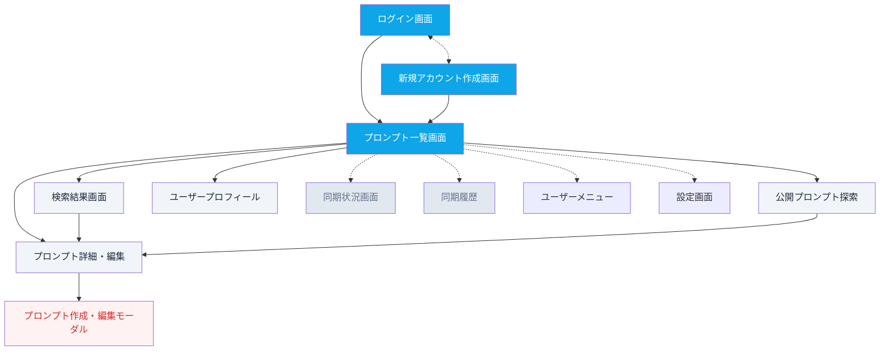

# PromPalette Web App - UI/UXデザイン設計書

**📅 設計日**: 2025-01-13  
**🎨 UIデザイナー**: Claude Code  
**🎯 対象**: PromPalette Web App MVP  
**🖥️ Desktop一貫性**: 100%統一設計

---

## 🌐 URL設計（GitHub風）

### **URLルーティング構造**

```typescript
// ==========================================
// GitHub-Style URL Routing Structure
// ==========================================

// 認証関連（GitHub風）
'/login'                   // ログイン画面（GitHub風）
'/signup'                  // 新規アカウント作成画面
'/logout'                  // ログアウト
'/auth/callback/[provider]' // OAuth認証コールバック

// メイン機能（GitHub風）
'/'                        // ダッシュボード（GitHub風ホーム）
'/search'                  // 検索結果画面
'/search?q=[query]'        // クエリパラメータ付き検索
'/search?scope=[scope]'    // スコープ指定検索

// 公開プロンプト探索（GitHub風）
'/explore'                 // 公開プロンプト探索トップ
'/trending'                // トレンドプロンプト（GitHub Trending風）
'/explore/recent'          // 最新プロンプト
'/explore/popular'         // 人気プロンプト
'/explore/tags'            // タグ一覧
'/explore/tags/[tag]'      // タグ別プロンプト一覧

// ユーザー関連（階層構造）
'/[username]'              // ユーザープロフィール（デフォルト）
'/[username]/prompts'      // プロンプト一覧ページ

// プロンプト関連（階層構造）
'/prompts/new'             // 新規プロンプト作成
'/[username]/prompts/[prompt-slug]' // プロンプト詳細
'/[username]/prompts/[prompt-slug]/edit' // プロンプト編集

// 設定関連（GitHub風）
'/settings'                // アカウント設定
'/settings/profile'        // プロフィール設定

// 同期関連（優先度低）
'/sync'                    // 同期状況
'/sync/history'            // 同期履歴

// その他（GitHub風）
'/help'                    // ヘルプ
'/privacy'                 // プライバシーポリシー
'/terms'                   // 利用規約
'/download'                // Desktop版ダウンロード
```

### **検索URL設計（GitHub風）**

```typescript
// 検索クエリパラメータ設計（GitHub風）
interface SearchParams {
  q?: string;                    // 検索クエリ
  scope?: 'all' | 'mine' | 'public'; // 検索スコープ
  type?: 'all' | 'title' | 'content' | 'tags' | 'user'; // 検索タイプ
  sort?: 'relevance' | 'created_at' | 'updated_at' | 'popularity'; // ソート
  page?: number;                 // ページ番号
  per_page?: number;             // 表示件数
}

// GitHub風検索構文サポート
'@username'                    // ユーザー検索（@john）
'@username /quickkey'          // 特定ユーザーの特定プロンプト
'#tag'                         // タグ検索（#productivity）

// URL例（GitHub風）
'/search?q=code+review&scope=public&sort=popularity'
'/search?q=%23productivity&type=tags'
'/search?q=%40john&type=user'
'/search?q=%40john+%2Freview&scope=all'
'/explore/tags/productivity?sort=popularity'
```

### **プロンプト詳細URL設計（階層構造）**

```typescript
// 階層構造プロンプトアクセスURL（既存機能のみ）
'/[username]/prompts/[prompt-slug]'      // プロンプト詳細
'/[username]/prompts/[prompt-slug]/edit' // プロンプト編集

// slug生成ルール
function generateSlug(title: string, quickAccessKey?: string): string {
  if (quickAccessKey) {
    return quickAccessKey;
  }
  return title
    ?.toLowerCase()
    .replace(/[^a-z0-9\s-]/g, '')
    .replace(/\s+/g, '-')
    .slice(0, 50) || 'untitled';
}

// URL例
'/john/prompts/code-review-best-practices'    // タイトルベースのslug
'/sarah/prompts/mykey'                        // quickAccessKeyベースのslug
'/mike/prompts/react-component-helper/edit'   // 編集ページ
```

### **ユーザープロフィールURL設計（階層構造）**

```typescript
// 階層構造ユーザーページ（既存機能のみ）
'/[username]'                  // ユーザープロフィール（デフォルト）
'/[username]/prompts'          // プロンプト一覧（直接URL）

// URL例
'/john'                        // johnのプロフィール概要
'/john/prompts'               // johnのプロンプト一覧（直接URL）
```

---

## 🎨 デザインシステム

### **デザイン原則**

#### **1. Desktop体験完全統一**
- Visual hierarchy 100%一致
- Color palette 完全統一
- Typography 完全同期
- Interaction patterns 統一

#### **2. 直感的操作性**
- Zero learning curve (Desktop経験者)
- Keyboard-first navigation
- Quick access patterns
- Contextual actions

#### **3. レスポンシブファースト**
- Mobile-first approach
- Progressive enhancement
- Touch-friendly targets
- Adaptive layouts

#### **4. アクセシビリティ**
- WCAG 2.1 AA準拠
- Screen reader対応
- Keyboard navigation
- Color contrast 4.5:1以上

### **カラーパレット**

```css
/* ==========================================
   Color System - Desktop App Unified
   ========================================== */

:root {
  /* Primary Colors - PromPalette Brand */
  --color-primary-50: #f0f9ff;
  --color-primary-100: #e0f2fe;
  --color-primary-200: #bae6fd;
  --color-primary-300: #7dd3fc;
  --color-primary-400: #38bdf8;
  --color-primary-500: #0ea5e9;  /* Main brand color */
  --color-primary-600: #0284c7;
  --color-primary-700: #0369a1;
  --color-primary-800: #075985;
  --color-primary-900: #0c4a6e;

  /* Neutral Colors - UI Foundation */
  --color-neutral-0: #ffffff;
  --color-neutral-50: #f8fafc;
  --color-neutral-100: #f1f5f9;
  --color-neutral-200: #e2e8f0;
  --color-neutral-300: #cbd5e1;
  --color-neutral-400: #94a3b8;
  --color-neutral-500: #64748b;
  --color-neutral-600: #475569;
  --color-neutral-700: #334155;
  --color-neutral-800: #1e293b;
  --color-neutral-900: #0f172a;

  /* Semantic Colors */
  --color-success-50: #f0fdf4;
  --color-success-500: #22c55e;
  --color-success-600: #16a34a;

  --color-warning-50: #fffbeb;
  --color-warning-500: #f59e0b;
  --color-warning-600: #d97706;

  --color-error-50: #fef2f2;
  --color-error-500: #ef4444;
  --color-error-600: #dc2626;

  --color-info-50: #eff6ff;
  --color-info-500: #3b82f6;
  --color-info-600: #2563eb;

  /* Desktop Theme Compatibility */
  --color-background-primary: var(--color-neutral-0);
  --color-background-secondary: var(--color-neutral-50);
  --color-background-tertiary: var(--color-neutral-100);
  
  --color-text-primary: var(--color-neutral-900);
  --color-text-secondary: var(--color-neutral-600);
  --color-text-tertiary: var(--color-neutral-400);
  
  --color-border-primary: var(--color-neutral-200);
  --color-border-secondary: var(--color-neutral-100);
  
  --color-surface-hover: var(--color-neutral-50);
  --color-surface-active: var(--color-neutral-100);
}

/* Dark Theme - Desktop App Compatible */
[data-theme="dark"] {
  --color-background-primary: var(--color-neutral-900);
  --color-background-secondary: var(--color-neutral-800);
  --color-background-tertiary: var(--color-neutral-700);
  
  --color-text-primary: var(--color-neutral-100);
  --color-text-secondary: var(--color-neutral-300);
  --color-text-tertiary: var(--color-neutral-500);
  
  --color-border-primary: var(--color-neutral-700);
  --color-border-secondary: var(--color-neutral-800);
  
  --color-surface-hover: var(--color-neutral-800);
  --color-surface-active: var(--color-neutral-700);
}
```

### **タイポグラフィ**

```css
/* ==========================================
   Typography System - Desktop Unified
   ========================================== */

:root {
  /* Font Families */
  --font-sans: 'Inter Variable', 'Noto Sans JP', -apple-system, BlinkMacSystemFont, system-ui, sans-serif;
  --font-mono: 'JetBrains Mono Variable', 'SF Mono', 'Monaco', 'Cascadia Code', monospace;

  /* Font Sizes - Desktop App Scale */
  --text-xs: 0.75rem;    /* 12px */
  --text-sm: 0.875rem;   /* 14px */
  --text-base: 1rem;     /* 16px */
  --text-lg: 1.125rem;   /* 18px */
  --text-xl: 1.25rem;    /* 20px */
  --text-2xl: 1.5rem;    /* 24px */
  --text-3xl: 1.875rem;  /* 30px */
  --text-4xl: 2.25rem;   /* 36px */

  /* Line Heights */
  --leading-tight: 1.25;
  --leading-normal: 1.5;
  --leading-relaxed: 1.75;

  /* Font Weights */
  --font-normal: 400;
  --font-medium: 500;
  --font-semibold: 600;
  --font-bold: 700;

  /* Letter Spacing */
  --tracking-tight: -0.025em;
  --tracking-normal: 0em;
  --tracking-wide: 0.025em;
}

/* Typography Classes */
.typography-h1 {
  font-size: var(--text-4xl);
  font-weight: var(--font-bold);
  line-height: var(--leading-tight);
  letter-spacing: var(--tracking-tight);
  color: var(--color-text-primary);
}

.typography-h2 {
  font-size: var(--text-3xl);
  font-weight: var(--font-semibold);
  line-height: var(--leading-tight);
  color: var(--color-text-primary);
}

.typography-h3 {
  font-size: var(--text-2xl);
  font-weight: var(--font-semibold);
  line-height: var(--leading-normal);
  color: var(--color-text-primary);
}

.typography-body-lg {
  font-size: var(--text-lg);
  font-weight: var(--font-normal);
  line-height: var(--leading-normal);
  color: var(--color-text-primary);
}

.typography-body {
  font-size: var(--text-base);
  font-weight: var(--font-normal);
  line-height: var(--leading-normal);
  color: var(--color-text-primary);
}

.typography-body-sm {
  font-size: var(--text-sm);
  font-weight: var(--font-normal);
  line-height: var(--leading-normal);
  color: var(--color-text-secondary);
}

.typography-caption {
  font-size: var(--text-xs);
  font-weight: var(--font-medium);
  line-height: var(--leading-normal);
  color: var(--color-text-tertiary);
  text-transform: uppercase;
  letter-spacing: var(--tracking-wide);
}

.typography-code {
  font-family: var(--font-mono);
  font-size: var(--text-sm);
  font-weight: var(--font-normal);
  background-color: var(--color-background-tertiary);
  padding: 0.125rem 0.25rem;
  border-radius: 0.25rem;
}
```

### **スペーシングシステム**

```css
/* ==========================================
   Spacing System - 8px Grid
   ========================================== */

:root {
  --space-0: 0rem;      /* 0px */
  --space-1: 0.25rem;   /* 4px */
  --space-2: 0.5rem;    /* 8px */
  --space-3: 0.75rem;   /* 12px */
  --space-4: 1rem;      /* 16px */
  --space-5: 1.25rem;   /* 20px */
  --space-6: 1.5rem;    /* 24px */
  --space-8: 2rem;      /* 32px */
  --space-10: 2.5rem;   /* 40px */
  --space-12: 3rem;     /* 48px */
  --space-16: 4rem;     /* 64px */
  --space-20: 5rem;     /* 80px */
  --space-24: 6rem;     /* 96px */

  /* Component Specific Spacing */
  --spacing-component-padding: var(--space-4);
  --spacing-component-margin: var(--space-6);
  --spacing-section-padding: var(--space-8);
  --spacing-page-padding: var(--space-6);
}
```

### **シャドウシステム**

```css
/* ==========================================
   Shadow System - Elevation
   ========================================== */

:root {
  --shadow-xs: 0 1px 2px 0 rgb(0 0 0 / 0.05);
  --shadow-sm: 0 1px 3px 0 rgb(0 0 0 / 0.1), 0 1px 2px -1px rgb(0 0 0 / 0.1);
  --shadow-base: 0 4px 6px -1px rgb(0 0 0 / 0.1), 0 2px 4px -2px rgb(0 0 0 / 0.1);
  --shadow-md: 0 10px 15px -3px rgb(0 0 0 / 0.1), 0 4px 6px -4px rgb(0 0 0 / 0.1);
  --shadow-lg: 0 20px 25px -5px rgb(0 0 0 / 0.1), 0 8px 10px -6px rgb(0 0 0 / 0.1);
  --shadow-xl: 0 25px 50px -12px rgb(0 0 0 / 0.25);

  /* Focus shadows */
  --shadow-focus-primary: 0 0 0 3px rgb(14 165 233 / 0.1);
  --shadow-focus-error: 0 0 0 3px rgb(239 68 68 / 0.1);
}
```

### **アニメーション**

```css
/* ==========================================
   Animation System - Smooth Interactions
   ========================================== */

:root {
  /* Timing Functions */
  --ease-out-expo: cubic-bezier(0.16, 1, 0.3, 1);
  --ease-out-back: cubic-bezier(0.34, 1.56, 0.64, 1);
  --ease-in-out-circ: cubic-bezier(0.785, 0.135, 0.15, 0.86);

  /* Durations */
  --duration-fast: 150ms;
  --duration-normal: 250ms;
  --duration-slow: 350ms;

  /* Common Transitions */
  --transition-colors: color var(--duration-fast) var(--ease-out-expo),
                       background-color var(--duration-fast) var(--ease-out-expo),
                       border-color var(--duration-fast) var(--ease-out-expo);
  
  --transition-transform: transform var(--duration-normal) var(--ease-out-expo);
  --transition-opacity: opacity var(--duration-fast) var(--ease-out-expo);
  --transition-shadow: box-shadow var(--duration-normal) var(--ease-out-expo);
}

/* Animation Classes */
.animate-fade-in {
  animation: fadeIn var(--duration-normal) var(--ease-out-expo);
}

.animate-slide-up {
  animation: slideUp var(--duration-normal) var(--ease-out-expo);
}

.animate-scale-in {
  animation: scaleIn var(--duration-fast) var(--ease-out-back);
}

@keyframes fadeIn {
  from { opacity: 0; }
  to { opacity: 1; }
}

@keyframes slideUp {
  from { 
    opacity: 0;
    transform: translateY(10px);
  }
  to { 
    opacity: 1;
    transform: translateY(0);
  }
}

@keyframes scaleIn {
  from { 
    opacity: 0;
    transform: scale(0.95);
  }
  to { 
    opacity: 1;
    transform: scale(1);
  }
}
```

---

## 📱 画面設計・ワイヤーフレーム

### **画面構成概要**



### **1. 認証画面設計**

#### **1.1 ログイン画面**

#### **レイアウト構造**
```
┌─────────────────────────────────────┐
│                 Header              │ 64px
│         PromPalette Logo            │
├─────────────────────────────────────┤
│                                     │
│              Main Content           │ flex-1
│                                     │
│    ┌─────────────────────────────┐   │
│    │     Welcome Message         │   │
│    │                             │   │
│    │  ┌─────────────────────────┐ │   │
│    │  │    GitHub Login         │ │   │
│    │  ├─────────────────────────┤ │   │
│    │  │    Google Login         │ │   │
│    │  ├─────────────────────────┤ │   │
│    │  │    Apple Login          │ │   │
│    │  └─────────────────────────┘ │   │
│    │                             │   │
│    │       Privacy Note          │   │
│    └─────────────────────────────┘   │
│                                     │
├─────────────────────────────────────┤
│               Footer                │ 48px
└─────────────────────────────────────┘
```

#### **コンポーネント詳細**

```typescript
// Login Page Component Structure
interface LoginPageProps {
  searchParams: { 
    callbackUrl?: string;
    error?: string;
  };
}

const LoginPage = ({ searchParams }: LoginPageProps) => {
  return (
    <div className="min-h-screen bg-gradient-to-br from-primary-50 to-primary-100">
      {/* Header */}
      <header className="flex items-center justify-center py-8">
        <div className="flex items-center space-x-3">
          <PromPaletteLogo className="h-8 w-8" />
          <h1 className="typography-h2 text-primary-700">PromPalette</h1>
        </div>
      </header>

      {/* Main Content */}
      <main className="flex items-center justify-center px-4">
        <div className="w-full max-w-md">
          <Card className="p-8 shadow-lg">
            {/* Welcome Message */}
            <div className="text-center mb-8">
              <h2 className="typography-h3 mb-2">Webでも、Desktopと同じ体験を</h2>
              <p className="typography-body-sm text-neutral-600">
                プロンプトをクラウドで同期して、どこからでもアクセス
              </p>
            </div>

            {/* OAuth Buttons */}
            <div className="space-y-3">
              <OAuthButton provider="github">
                <GitHubIcon className="w-5 h-5 mr-3" />
                GitHubでログイン
              </OAuthButton>
              
              <OAuthButton provider="google">
                <GoogleIcon className="w-5 h-5 mr-3" />
                Googleでログイン
              </OAuthButton>
              
              <OAuthButton provider="apple">
                <AppleIcon className="w-5 h-5 mr-3" />
                Appleでログイン
              </OAuthButton>
            </div>

            {/* Privacy Note */}
            <p className="typography-caption text-center mt-6">
              ログインすることで、
              <Link href="/privacy" className="text-primary-600 hover:underline">
                プライバシーポリシー
              </Link>
              と
              <Link href="/terms" className="text-primary-600 hover:underline">
                利用規約
              </Link>
              に同意したものとみなされます。
            </p>
            
            {/* Sign Up Link */}
            <div className="text-center mt-4 pt-4 border-t border-neutral-200">
              <p className="typography-body-sm text-neutral-600">
                初めての方は
                <Link 
                  href="/signup" 
                  className="text-primary-600 hover:underline font-medium ml-1"
                >
                  アカウント作成
                </Link>
              </p>
            </div>
          </Card>
        </div>
      </main>

      {/* Footer */}
      <footer className="text-center py-6">
        <p className="typography-caption">
          © 2025 PromPalette. Desktop版は
          <Link href="/download" className="text-primary-600 hover:underline">
            こちら
          </Link>
          からダウンロード
        </p>
      </footer>
    </div>
  );
};
```

#### **1.2 新規アカウント作成画面**

#### **レイアウト構造**
```
┌─────────────────────────────────────┐
│                 Header              │ 64px
│         PromPalette Logo            │
├─────────────────────────────────────┤
│                                     │
│              Main Content           │ flex-1
│                                     │
│    ┌─────────────────────────────┐   │
│    │     Account Setup Form     │   │
│    │                             │   │
│    │  ┌─────────────────────────┐ │   │
│    │  │   Display Name Field   │ │   │
│    │  ├─────────────────────────┤ │   │
│    │  │    GitHub Login        │ │   │
│    │  ├─────────────────────────┤ │   │
│    │  │    Google Login        │ │   │
│    │  ├─────────────────────────┤ │   │
│    │  │    Apple Login         │ │   │
│    │  └─────────────────────────┘ │   │
│    │                             │   │
│    │    Privacy & Terms Note    │   │
│    │      Login Link              │   │
│    └─────────────────────────────┘   │
│                                     │
├─────────────────────────────────────┤
│               Footer                │ 48px
└─────────────────────────────────────┘
```

#### **コンポーネント詳細**

```typescript
// Sign Up Page Component Structure
interface SignUpPageProps {
  searchParams: { 
    callbackUrl?: string;
    error?: string;
  };
}

const SignUpPage = ({ searchParams }: SignUpPageProps) => {
  const [displayName, setDisplayName] = useState('');
  const [isValid, setIsValid] = useState(false);
  
  // Display Name Validation
  useEffect(() => {
    const isValidName = displayName.trim().length >= 2 && displayName.trim().length <= 30;
    setIsValid(isValidName);
  }, [displayName]);

  return (
    <div className="min-h-screen bg-gradient-to-br from-primary-50 to-primary-100">
      {/* Header */}
      <header className="flex items-center justify-center py-8">
        <div className="flex items-center space-x-3">
          <PromPaletteLogo className="h-8 w-8" />
          <h1 className="typography-h2 text-primary-700">PromPalette</h1>
        </div>
      </header>

      {/* Main Content */}
      <main className="flex items-center justify-center px-4">
        <div className="w-full max-w-md">
          <Card className="p-8 shadow-lg">
            {/* Welcome Message */}
            <div className="text-center mb-8">
              <h2 className="typography-h3 mb-2">アカウント作成</h2>
              <p className="typography-body-sm text-neutral-600">
                プロンプトをクラウドで管理し、どこからでもアクセス
              </p>
            </div>

            {/* Display Name Input */}
            <div className="mb-6">
              <Label htmlFor="displayName" className="typography-body font-medium mb-2 block">
                表示名 <span className="text-error-500">*</span>
              </Label>
              <Input
                id="displayName"
                type="text"
                value={displayName}
                onChange={(e) => setDisplayName(e.target.value)}
                placeholder="あなたの名前またはニックネーム"
                maxLength={30}
                className={cn(
                  "typography-body",
                  displayName && !isValid && "border-error-500 focus:border-error-500"
                )}
                required
              />
              <div className="flex justify-between items-center mt-1">
                <p className="typography-caption text-neutral-500">
                  2-30文字で入力してください
                </p>
                <p className="typography-caption text-neutral-400">
                  {displayName.length}/30
                </p>
              </div>
              {displayName && !isValid && (
                <p className="typography-caption text-error-500 mt-1">
                  表示名は2文字以上30文字以下で入力してください
                </p>
              )}
            </div>

            {/* OAuth Buttons */}
            <div className="space-y-3">
              <OAuthButton 
                provider="github" 
                disabled={!isValid}
                callbackUrl={searchParams.callbackUrl}
                displayName={displayName.trim()}
              >
                <GitHubIcon className="w-5 h-5 mr-3" />
                GitHubでアカウント作成
              </OAuthButton>
              
              <OAuthButton 
                provider="google" 
                disabled={!isValid}
                callbackUrl={searchParams.callbackUrl}
                displayName={displayName.trim()}
              >
                <GoogleIcon className="w-5 h-5 mr-3" />
                Googleでアカウント作成
              </OAuthButton>
              
              <OAuthButton 
                provider="apple" 
                disabled={!isValid}
                callbackUrl={searchParams.callbackUrl}
                displayName={displayName.trim()}
              >
                <AppleIcon className="w-5 h-5 mr-3" />
                Appleでアカウント作成
              </OAuthButton>
            </div>

            {/* Privacy Note */}
            <p className="typography-caption text-center mt-6">
              アカウントを作成することで、
              <Link href="/privacy" className="text-primary-600 hover:underline">
                プライバシーポリシー
              </Link>
              と
              <Link href="/terms" className="text-primary-600 hover:underline">
                利用規約
              </Link>
              に同意したものとみなされます。
            </p>
            
            {/* Login Link */}
            <div className="text-center mt-4 pt-4 border-t border-neutral-200">
              <p className="typography-body-sm text-neutral-600">
                すでにアカウントをお持ちの方は
                <Link 
                  href="/login" 
                  className="text-primary-600 hover:underline font-medium ml-1"
                >
                  ログイン
                </Link>
              </p>
            </div>
          </Card>
        </div>
      </main>

      {/* Footer */}
      <footer className="text-center py-6">
        <p className="typography-caption">
          © 2025 PromPalette. Desktop版は
          <Link href="/download" className="text-primary-600 hover:underline">
            こちら
          </Link>
          からダウンロード
        </p>
      </footer>
    </div>
  );
};

// Enhanced OAuth Button for Sign Up
interface OAuthButtonProps {
  provider: 'github' | 'google' | 'apple';
  children: React.ReactNode;
  disabled?: boolean;
  callbackUrl?: string;
  displayName: string;
}

const OAuthButton = ({ 
  provider, 
  children, 
  disabled, 
  callbackUrl, 
  displayName 
}: OAuthButtonProps) => {
  const handleSignUp = () => {
    if (disabled || !displayName) return;
    
    // Include display name in OAuth flow
    const params = new URLSearchParams({
      ...(callbackUrl && { callbackUrl }),
      displayName,
      action: 'signup'
    });
    
    window.location.href = `/api/auth/signin/${provider}?${params.toString()}`;
  };

  return (
    <Button
      onClick={handleSignUp}
      disabled={disabled}
      className={cn(
        "w-full flex items-center justify-center py-3 transition-all",
        disabled 
          ? "opacity-50 cursor-not-allowed" 
          : "hover:shadow-sm active:scale-[0.98]"
      )}
      variant="outline"
    >
      {children}
    </Button>
  );
};
```

### **2. プロンプト一覧画面設計**

#### **レイアウト構造（Desktop風）**
```
┌─────────────────────────────────────────────────────────────┐
│                    App Header                               │ 64px
│  Logo | Search Bar           | Sync | User Menu             │
├─────────────────────────────────────────────────────────────┤
│                                                             │
│                     Main Content                            │ flex-1
│                                                             │
│  ┌─────────────────────────────────────────────────────┐   │
│  │              Action Bar                             │   │ 48px
│  │   📝 New  | 🏷️ Tags: all  | 🔄 Last sync: 2m ago    │   │
│  ├─────────────────────────────────────────────────────┤   │
│  │                                                     │   │
│  │              Prompt Cards Grid                      │   │ flex-1
│  │  ┌─────────────┐ ┌─────────────┐ ┌─────────────┐   │   │
│  │  │   Prompt    │ │   Prompt    │ │   Prompt    │   │   │
│  │  │    Card     │ │    Card     │ │    Card     │   │   │
│  │  │             │ │             │ │             │   │   │
│  │  └─────────────┘ └─────────────┘ └─────────────┘   │   │
│  │  ┌─────────────┐ ┌─────────────┐ ┌─────────────┐   │   │
│  │  │   Prompt    │ │   Prompt    │ │   Prompt    │   │   │
│  │  │    Card     │ │    Card     │ │    Card     │   │   │
│  │  │             │ │             │ │             │   │   │
│  │  └─────────────┘ └─────────────┘ └─────────────┘   │   │
│  │                                                     │   │
│  └─────────────────────────────────────────────────────┘   │
│                                                             │
└─────────────────────────────────────────────────────────────┘
```

#### **プロンプトカード設計**
```typescript
interface PromptCardProps {
  prompt: Prompt;
  onCopy: (content: string) => void;
  onEdit: (prompt: Prompt) => void;
  onDelete: (id: string) => void;
  searchQuery?: string;
}

const PromptCard = ({ prompt, onCopy, onEdit, onDelete, searchQuery }: PromptCardProps) => {
  return (
    <Card className="group relative overflow-hidden transition-all duration-200 hover:shadow-md hover:scale-[1.02]">
      {/* Card Header */}
      <div className="p-4 pb-2">
        <div className="flex items-start justify-between">
          <div className="flex-1 min-w-0">
            {prompt.title ? (
              <h3 className="typography-body font-medium text-neutral-900 truncate">
                <HighlightText text={prompt.title} highlight={searchQuery} />
              </h3>
            ) : (
              <h3 className="typography-body font-medium text-neutral-400 italic">
                無題のプロンプト
              </h3>
            )}
            
            {/* Quick Access Key */}
            {prompt.quickAccessKey && (
              <div className="flex items-center mt-1">
                <KeyboardIcon className="w-3 h-3 text-neutral-400 mr-1" />
                <span className="typography-caption text-neutral-500">
                  /{prompt.quickAccessKey}
                </span>
              </div>
            )}
          </div>

          {/* Actions Menu */}
          <DropdownMenu>
            <DropdownMenuTrigger asChild>
              <Button variant="ghost" size="sm" className="opacity-0 group-hover:opacity-100">
                <MoreVerticalIcon className="w-4 h-4" />
              </Button>
            </DropdownMenuTrigger>
            <DropdownMenuContent align="end">
              <DropdownMenuItem onClick={() => onCopy(prompt.content)}>
                <CopyIcon className="w-4 h-4 mr-2" />
                コピー
              </DropdownMenuItem>
              <DropdownMenuItem onClick={() => onEdit(prompt)}>
                <EditIcon className="w-4 h-4 mr-2" />
                編集
              </DropdownMenuItem>
              <DropdownMenuItem 
                onClick={() => onDelete(prompt.id)}
                className="text-error-600"
              >
                <TrashIcon className="w-4 h-4 mr-2" />
                削除
              </DropdownMenuItem>
            </DropdownMenuContent>
          </DropdownMenu>
        </div>
      </div>

      {/* Card Content */}
      <div className="px-4 pb-2">
        <p className="typography-body-sm text-neutral-600 line-clamp-3">
          <HighlightText text={prompt.content} highlight={searchQuery} />
        </p>
      </div>

      {/* Card Footer */}
      <div className="px-4 pb-4">
        {/* Tags */}
        {prompt.tags.length > 0 && (
          <div className="flex flex-wrap gap-1 mb-3">
            {prompt.tags.slice(0, 3).map((tag) => (
              <Badge 
                key={tag} 
                variant="secondary" 
                className="text-xs"
              >
                <HighlightText text={tag} highlight={searchQuery} />
              </Badge>
            ))}
            {prompt.tags.length > 3 && (
              <Badge variant="outline" className="text-xs">
                +{prompt.tags.length - 3}
              </Badge>
            )}
          </div>
        )}

        {/* Metadata */}
        <div className="flex items-center justify-between text-neutral-400">
          <span className="typography-caption">
            {formatDistanceToNow(new Date(prompt.updatedAt), { 
              addSuffix: true,
              locale: ja 
            })}
          </span>
          
          {prompt.lastSyncedAt && (
            <div className="flex items-center">
              <SyncIcon className="w-3 h-3 mr-1" />
              <span className="typography-caption">同期済み</span>
            </div>
          )}
        </div>
      </div>

      {/* Quick Copy Button */}
      <Button
        size="sm"
        className="absolute bottom-2 right-2 opacity-0 group-hover:opacity-100 transition-opacity"
        onClick={(e) => {
          e.stopPropagation();
          onCopy(prompt.content);
        }}
      >
        <CopyIcon className="w-4 h-4" />
      </Button>
    </Card>
  );
};
```

### **3. 検索機能設計（公開プロンプト対応）**

#### **拡張検索バーコンポーネント**
```typescript
interface SearchBarProps {
  value: string;
  onChange: (value: string) => void;
  onSearch: (query: string) => void;
  scope: 'all' | 'mine' | 'public';
  onScopeChange: (scope: 'all' | 'mine' | 'public') => void;
  isLoading?: boolean;
  placeholder?: string;
}

const SearchBar = ({ 
  value, 
  onChange, 
  onSearch, 
  scope, 
  onScopeChange, 
  isLoading, 
  placeholder 
}: SearchBarProps) => {
  const [focused, setFocused] = useState(false);
  const [suggestions, setSuggestions] = useState<SearchSuggestion[]>([]);
  const [showSuggestions, setShowSuggestions] = useState(false);

  const parseSearchQuery = (query: string) => {
    const isTagSearch = query.startsWith('#');
    const isKeySearch = query.startsWith('/');
    const isUserSearch = query.startsWith('@');
    const isUserKeySearch = /@\w+\s+\/\w+/.test(query);
    
    return { isTagSearch, isKeySearch, isUserSearch, isUserKeySearch };
  };

  const { isTagSearch, isKeySearch, isUserSearch, isUserKeySearch } = parseSearchQuery(value);

  return (
    <div className="relative">
      {/* Search Scope Tabs */}
      <div className="flex mb-2 bg-neutral-50 rounded-lg p-1">
        <button
          onClick={() => onScopeChange('all')}
          className={cn(
            "flex-1 py-1 px-3 rounded-md text-sm transition-colors",
            scope === 'all' 
              ? "bg-white shadow-sm text-primary-700 font-medium" 
              : "text-neutral-600 hover:text-neutral-900"
          )}
        >
          全て
        </button>
        <button
          onClick={() => onScopeChange('mine')}
          className={cn(
            "flex-1 py-1 px-3 rounded-md text-sm transition-colors",
            scope === 'mine' 
              ? "bg-white shadow-sm text-primary-700 font-medium" 
              : "text-neutral-600 hover:text-neutral-900"
          )}
        >
          マイプロンプト
        </button>
        <button
          onClick={() => onScopeChange('public')}
          className={cn(
            "flex-1 py-1 px-3 rounded-md text-sm transition-colors",
            scope === 'public' 
              ? "bg-white shadow-sm text-primary-700 font-medium" 
              : "text-neutral-600 hover:text-neutral-900"
          )}
        >
          公開プロンプト
        </button>
      </div>

      {/* Search Input */}
      <div className={cn(
        "relative flex items-center rounded-lg border transition-all",
        focused 
          ? "border-primary-500 shadow-focus-primary" 
          : "border-neutral-200 hover:border-neutral-300"
      )}>
        <SearchIcon className="w-5 h-5 text-neutral-400 ml-3" />
        
        <input
          type="text"
          value={value}
          onChange={(e) => onChange(e.target.value)}
          onFocus={() => {
            setFocused(true);
            setShowSuggestions(true);
          }}
          onBlur={() => {
            setFocused(false);
            setTimeout(() => setShowSuggestions(false), 150);
          }}
          onKeyDown={(e) => {
            if (e.key === 'Enter') {
              onSearch(value);
              setShowSuggestions(false);
            }
          }}
          placeholder={
            placeholder || 
            scope === 'public' 
              ? "公開プロンプトを検索... (#tag, @user, /key)"
              : "プロンプトを検索... (#tag, @user, /key)"
          }
          className="flex-1 py-2 px-3 bg-transparent border-0 outline-none typography-body"
        />

        {/* Search Type Indicators */}
        <div className="flex items-center gap-1 px-3">
          {isTagSearch && (
            <Badge variant="outline" className="text-xs">
              <TagIcon className="w-3 h-3 mr-1" />
              タグ検索
            </Badge>
          )}
          {isKeySearch && (
            <Badge variant="outline" className="text-xs">
              <KeyIcon className="w-3 h-3 mr-1" />
              キー検索
            </Badge>
          )}
          {isUserSearch && (
            <Badge variant="outline" className="text-xs">
              <UserIcon className="w-3 h-3 mr-1" />
              {isUserKeySearch ? "ユーザー+キー" : "ユーザー検索"}
            </Badge>
          )}
          {isLoading && (
            <LoadingSpinner className="w-4 h-4" />
          )}
        </div>

        {/* Clear Button */}
        {value && (
          <Button
            variant="ghost"
            size="sm"
            onClick={() => onChange('')}
            className="mr-1"
          >
            <XIcon className="w-4 h-4" />
          </Button>
        )}
      </div>

      {/* Search Suggestions Dropdown */}
      {showSuggestions && suggestions.length > 0 && (
        <div className="absolute top-full left-0 right-0 mt-1 bg-white border border-neutral-200 rounded-lg shadow-lg z-50">
          <div className="py-2">
            {suggestions.map((suggestion, index) => (
              <button
                key={`${suggestion.type}-${index}`}
                onClick={() => {
                  onChange(suggestion.value);
                  onSearch(suggestion.value);
                  setShowSuggestions(false);
                }}
                className="w-full flex items-center px-3 py-2 hover:bg-neutral-50 transition-colors"
              >
                <div className="flex items-center gap-2">
                  {suggestion.type === 'tag' && <TagIcon className="w-4 h-4 text-primary-500" />}
                  {suggestion.type === 'user' && <UserIcon className="w-4 h-4 text-primary-500" />}
                  {suggestion.type === 'quick_key' && <KeyIcon className="w-4 h-4 text-primary-500" />}
                  
                  <span className="typography-body">{suggestion.display}</span>
                  
                  {suggestion.count && (
                    <Badge variant="secondary" className="text-xs ml-auto">
                      {suggestion.count}
                    </Badge>
                  )}
                </div>
              </button>
            ))}
          </div>
        </div>
      )}

      {/* Search Help */}
      {focused && value === '' && (
        <Card className="absolute top-full left-0 right-0 mt-1 p-3 shadow-lg z-50">
          <div className="space-y-2">
            <p className="typography-caption text-neutral-600">検索のヒント:</p>
            <div className="space-y-1 text-neutral-500">
              <p className="typography-body-sm">• タイトルや内容を検索</p>
              <p className="typography-body-sm">• <code className="typography-code">#タグ名</code> でタグ検索</p>
              <p className="typography-body-sm">• <code className="typography-code">/キー</code> でクイックアクセスキー検索</p>
              <p className="typography-body-sm">• <code className="typography-code">@ユーザー名</code> でユーザーのプロンプト検索</p>
              <p className="typography-body-sm">• <code className="typography-code">@ユーザー名 /キー</code> で一意特定</p>
            </div>
          </div>
        </Card>
      )}
    </div>
  );
};

interface SearchSuggestion {
  type: 'tag' | 'user' | 'quick_key' | 'query';
  value: string;
  display: string;
  count?: number;
  avatar?: string; // for users
}
    </div>
  );
};
```

### **4. プロンプト編集モーダル設計**

#### **モーダル構造**
```typescript
interface PromptEditModalProps {
  prompt?: Prompt; // 編集時のみ
  isOpen: boolean;
  onClose: () => void;
  onSave: (data: CreatePromptRequest) => Promise<void>;
}

const PromptEditModal = ({ prompt, isOpen, onClose, onSave }: PromptEditModalProps) => {
  const [formData, setFormData] = useState<CreatePromptRequest>({
    title: prompt?.title || '',
    content: prompt?.content || '',
    tags: prompt?.tags || [],
    quickAccessKey: prompt?.quickAccessKey || '',
  });

  return (
    <Dialog open={isOpen} onOpenChange={onClose}>
      <DialogContent className="max-w-4xl max-h-[90vh] p-0">
        {/* Header */}
        <DialogHeader className="px-6 py-4 border-b">
          <DialogTitle className="typography-h3">
            {prompt ? 'プロンプトを編集' : '新しいプロンプト'}
          </DialogTitle>
          <DialogDescription className="typography-body-sm">
            Desktop版と同じ機能で、プロンプトを作成・編集できます
          </DialogDescription>
        </DialogHeader>

        {/* Form Content */}
        <div className="flex-1 overflow-hidden">
          <form className="h-full flex flex-col">
            <div className="flex-1 overflow-y-auto p-6 space-y-6">
              {/* Title Field */}
              <div className="space-y-2">
                <Label htmlFor="title" className="typography-body font-medium">
                  タイトル <span className="text-neutral-400">(任意)</span>
                </Label>
                <Input
                  id="title"
                  value={formData.title}
                  onChange={(e) => setFormData(prev => ({ ...prev, title: e.target.value }))}
                  placeholder="プロンプトのタイトル..."
                  maxLength={200}
                  className="typography-body"
                />
                <p className="typography-caption text-neutral-500">
                  {formData.title.length}/200文字
                </p>
              </div>

              {/* Content Field */}
              <div className="space-y-2">
                <Label htmlFor="content" className="typography-body font-medium">
                  内容 <span className="text-error-500">*</span>
                </Label>
                <Textarea
                  id="content"
                  value={formData.content}
                  onChange={(e) => setFormData(prev => ({ ...prev, content: e.target.value }))}
                  placeholder="プロンプトの内容を入力..."
                  maxLength={100000}
                  rows={12}
                  className="typography-body font-mono resize-none"
                  required
                />
                <p className="typography-caption text-neutral-500">
                  {formData.content.length.toLocaleString()}/100,000文字
                </p>
              </div>

              {/* Tags Field */}
              <div className="space-y-2">
                <Label htmlFor="tags" className="typography-body font-medium">
                  タグ <span className="text-neutral-400">(任意)</span>
                </Label>
                <TagInput
                  value={formData.tags}
                  onChange={(tags) => setFormData(prev => ({ ...prev, tags }))}
                  placeholder="タグをカンマ区切りで入力..."
                  maxTags={10}
                />
                <p className="typography-caption text-neutral-500">
                  {formData.tags.length}/10個のタグ
                </p>
              </div>

              {/* Quick Access Key Field */}
              <div className="space-y-2">
                <Label htmlFor="quickAccessKey" className="typography-body font-medium">
                  クイックアクセスキー <span className="text-neutral-400">(任意)</span>
                </Label>
                <div className="relative">
                  <span className="absolute left-3 top-1/2 -translate-y-1/2 text-neutral-400">
                    /
                  </span>
                  <Input
                    id="quickAccessKey"
                    value={formData.quickAccessKey}
                    onChange={(e) => setFormData(prev => ({ 
                      ...prev, 
                      quickAccessKey: e.target.value.replace(/[^a-zA-Z0-9]/g, '') 
                    }))}
                    placeholder="quick"
                    maxLength={20}
                    className="pl-6 typography-body font-mono"
                    pattern="[a-zA-Z0-9]{2,20}"
                  />
                </div>
                <p className="typography-caption text-neutral-500">
                  英数字2-20文字。検索時に「/キー」で素早くアクセス
                </p>
              </div>
            </div>

            {/* Footer Actions */}
            <div className="border-t px-6 py-4 flex items-center justify-between">
              <div className="flex items-center space-x-2">
                <KeyboardIcon className="w-4 h-4 text-neutral-400" />
                <span className="typography-caption text-neutral-500">
                  Ctrl+Enter で保存
                </span>
              </div>

              <div className="flex items-center space-x-2">
                <Button variant="outline" onClick={onClose}>
                  キャンセル
                </Button>
                <Button 
                  type="submit"
                  disabled={!formData.content.trim()}
                  className="min-w-[80px]"
                >
                  {prompt ? '更新' : '作成'}
                </Button>
              </div>
            </div>
          </form>
        </div>
      </DialogContent>
    </Dialog>
  );
};
```

### **5. 公開プロンプト表示設計**

#### **公開プロンプトカードコンポーネント**

```typescript
interface PublicPromptCardProps {
  prompt: {
    id: string;
    title: string | null;
    content: string;
    contentPreview: string;
    tags: string[];
    quickAccessKey: string | null;
    author: {
      id: string;
      displayName: string;
      avatarUrl?: string;
    };
    visibility: 'public' | 'unlisted';
    stats: {
      viewCount: number;
      copyCount: number;
    };
    createdAt: string;
    updatedAt: string;
  };
  searchQuery?: string;
  onCopy: (content: string) => void;
  onView: (promptId: string) => void;
  isOwner: boolean;
}

const PublicPromptCard = ({ 
  prompt, 
  searchQuery, 
  onCopy, 
  onView, 
  isOwner 
}: PublicPromptCardProps) => {
  return (
    <Card 
      className="group relative p-4 hover:shadow-md transition-all cursor-pointer border-l-4 border-l-transparent hover:border-l-primary-500"
      onClick={() => onView(prompt.id)}
    >
      {/* Header with Author Info */}
      <div className="flex items-start justify-between mb-3">
        <div className="flex items-center space-x-2">
          <Avatar className="w-6 h-6">
            <AvatarImage src={prompt.author.avatarUrl} />
            <AvatarFallback className="text-xs">
              {prompt.author.displayName.slice(0, 2).toUpperCase()}
            </AvatarFallback>
          </Avatar>
          <span className="typography-body-sm font-medium text-primary-700">
            @{prompt.author.displayName}
          </span>
          {isOwner && (
            <Badge variant="secondary" className="text-xs">
              自分
            </Badge>
          )}
        </div>
        
        {/* Visibility Indicator */}
        <div className="flex items-center space-x-1">
          {prompt.visibility === 'public' ? (
            <GlobeIcon className="w-4 h-4 text-green-500" />
          ) : (
            <EyeOffIcon className="w-4 h-4 text-orange-500" />
          )}
        </div>
      </div>

      {/* Title */}
      {prompt.title && (
        <h3 className="typography-h4 mb-2 text-neutral-900">
          <HighlightText text={prompt.title} highlight={searchQuery} />
        </h3>
      )}

      {/* Content Preview */}
      <div className="mb-3">
        <p className="typography-body text-neutral-700 line-clamp-3">
          <HighlightText text={prompt.contentPreview} highlight={searchQuery} />
        </p>
      </div>

      {/* Tags and Quick Access Key */}
      <div className="flex items-center justify-between mb-3">
        <div className="flex items-center space-x-2">
          {/* Tags */}
          {prompt.tags.length > 0 && (
            <div className="flex flex-wrap gap-1">
              {prompt.tags.slice(0, 3).map((tag) => (
                <Badge 
                  key={tag} 
                  variant="secondary" 
                  className="text-xs"
                >
                  <HighlightText text={`#${tag}`} highlight={searchQuery} />
                </Badge>
              ))}
              {prompt.tags.length > 3 && (
                <Badge variant="outline" className="text-xs">
                  +{prompt.tags.length - 3}
                </Badge>
              )}
            </div>
          )}
        </div>

        {/* Quick Access Key */}
        {prompt.quickAccessKey && (
          <Badge variant="outline" className="text-xs font-mono">
            <HighlightText text={`/${prompt.quickAccessKey}`} highlight={searchQuery} />
          </Badge>
        )}
      </div>

      {/* Stats and Metadata */}
      <div className="flex items-center justify-between text-neutral-400">
        <div className="flex items-center space-x-3">
          <div className="flex items-center space-x-1">
            <EyeIcon className="w-3 h-3" />
            <span className="typography-caption">{prompt.stats.viewCount}</span>
          </div>
          <div className="flex items-center space-x-1">
            <CopyIcon className="w-3 h-3" />
            <span className="typography-caption">{prompt.stats.copyCount}</span>
          </div>
        </div>
        
        <span className="typography-caption">
          {formatDistanceToNow(new Date(prompt.updatedAt), { 
            addSuffix: true,
            locale: ja 
          })}
        </span>
      </div>

      {/* Quick Copy Button */}
      <Button
        size="sm"
        variant="secondary"
        className="absolute bottom-2 right-2 opacity-0 group-hover:opacity-100 transition-opacity"
        onClick={(e) => {
          e.stopPropagation();
          onCopy(prompt.content);
        }}
      >
        <CopyIcon className="w-4 h-4" />
      </Button>
    </Card>
  );
};
```

#### **検索結果表示コンポーネント**

```typescript
interface SearchResultsProps {
  results: SearchResult[];
  searchQuery: string;
  scope: 'all' | 'mine' | 'public';
  isLoading: boolean;
  onLoadMore?: () => void;
  hasMore?: boolean;
}

const SearchResults = ({ 
  results, 
  searchQuery, 
  scope, 
  isLoading, 
  onLoadMore, 
  hasMore 
}: SearchResultsProps) => {
  if (isLoading && results.length === 0) {
    return (
      <div className="flex flex-col items-center justify-center py-12">
        <LoadingSpinner className="w-8 h-8 text-primary-500 mb-3" />
        <p className="typography-body text-neutral-600">検索中...</p>
      </div>
    );
  }

  if (results.length === 0) {
    return (
      <div className="flex flex-col items-center justify-center py-12">
        <SearchIcon className="w-12 h-12 text-neutral-300 mb-4" />
        <h3 className="typography-h3 text-neutral-600 mb-2">
          プロンプトが見つかりません
        </h3>
        <p className="typography-body text-neutral-500 text-center max-w-md">
          {scope === 'public' 
            ? '別のキーワードで検索してみてください。'
            : 'プロンプトを作成してコレクションを始めましょう。'
          }
        </p>
        {scope !== 'public' && (
          <Button className="mt-4">
            <PlusIcon className="w-4 h-4 mr-2" />
            新しいプロンプトを作成
          </Button>
        )}
      </div>
    );
  }

  return (
    <div className="space-y-4">
      {/* Results Header */}
      <div className="flex items-center justify-between">
        <p className="typography-body text-neutral-600">
          <span className="font-semibold">{results.length}</span>件のプロンプトが見つかりました
          {searchQuery && (
            <span>
              「<span className="font-semibold">{searchQuery}</span>」の検索結果
            </span>
          )}
        </p>
        
        {/* Sort Options */}
        <Select defaultValue="relevance">
          <SelectTrigger className="w-32">
            <SelectValue />
          </SelectTrigger>
          <SelectContent>
            <SelectItem value="relevance">関連度</SelectItem>
            <SelectItem value="created_at">作成日</SelectItem>
            <SelectItem value="updated_at">更新日</SelectItem>
            <SelectItem value="popularity">人気度</SelectItem>
          </SelectContent>
        </Select>
      </div>

      {/* Results Grid */}
      <div className="grid gap-4 md:grid-cols-2 lg:grid-cols-3">
        {results.map((result) => (
          scope === 'public' || result.visibility === 'public' ? (
            <PublicPromptCard
              key={result.id}
              prompt={result}
              searchQuery={searchQuery}
              onCopy={(content) => {
                navigator.clipboard.writeText(content);
                toast.success('プロンプトをコピーしました');
              }}
              onView={(id) => {
                // Navigate to prompt detail or open modal
              }}
              isOwner={result.isOwner}
            />
          ) : (
            <PromptCard
              key={result.id}
              prompt={result}
              searchQuery={searchQuery}
              onCopy={(content) => {
                navigator.clipboard.writeText(content);
                toast.success('プロンプトをコピーしました');
              }}
              onEdit={(prompt) => {
                // Open edit modal
              }}
              onDelete={(id) => {
                // Delete prompt
              }}
            />
          )
        ))}
      </div>

      {/* Load More Button */}
      {hasMore && (
        <div className="flex justify-center pt-6">
          <Button 
            variant="outline" 
            onClick={onLoadMore}
            disabled={isLoading}
          >
            {isLoading ? (
              <LoadingSpinner className="w-4 h-4 mr-2" />
            ) : (
              <ChevronDownIcon className="w-4 h-4 mr-2" />
            )}
            さらに読み込む
          </Button>
        </div>
      )}
    </div>
  );
};
```

### **6. 同期状況表示設計**

```typescript
interface SyncStatusProps {
  syncStatus: 'idle' | 'syncing' | 'success' | 'error';
  lastSyncTime?: string;
  onSync: () => void;
}

const SyncStatus = ({ syncStatus, lastSyncTime, onSync }: SyncStatusProps) => {
  return (
    <div className="flex items-center space-x-2">
      {/* Status Icon */}
      <div className="relative">
        {syncStatus === 'syncing' && (
          <LoadingSpinner className="w-4 h-4 text-primary-500 animate-spin" />
        )}
        {syncStatus === 'success' && (
          <CheckCircleIcon className="w-4 h-4 text-success-500" />
        )}
        {syncStatus === 'error' && (
          <AlertCircleIcon className="w-4 h-4 text-error-500" />
        )}
        {syncStatus === 'idle' && (
          <SyncIcon className="w-4 h-4 text-neutral-400" />
        )}
      </div>

      {/* Status Text */}
      <span className="typography-body-sm text-neutral-600">
        {syncStatus === 'syncing' && '同期中...'}
        {syncStatus === 'success' && lastSyncTime && (
          `${formatDistanceToNow(new Date(lastSyncTime), { addSuffix: true, locale: ja })}に同期`
        )}
        {syncStatus === 'error' && '同期エラー'}
        {syncStatus === 'idle' && '同期待機中'}
      </span>

      {/* Sync Button */}
      <Button
        variant="ghost"
        size="sm"
        onClick={onSync}
        disabled={syncStatus === 'syncing'}
        className="text-neutral-500 hover:text-primary-600"
      >
        <SyncIcon className={cn(
          "w-4 h-4",
          syncStatus === 'syncing' && "animate-spin"
        )} />
      </Button>
    </div>
  );
};
```

### **7. 発見ページ（Explore）設計 - Zenn/Qiita風**

#### **Exploreトップページ構造**

```typescript
interface ExplorePageProps {
  trendingPrompts: PublicPrompt[];
  recentPrompts: PublicPrompt[];
  popularTags: TagWithCount[];
  activeUsers: UserWithStats[];
}

const ExplorePage = () => {
  return (
    <div className="min-h-screen bg-neutral-50">
      {/* Hero Section */}
      <section className="bg-gradient-to-br from-primary-50 to-primary-100 py-12">
        <div className="container mx-auto px-4">
          <h1 className="typography-h1 text-center mb-4">
            優れたプロンプトを発見しよう
          </h1>
          <p className="typography-body text-center text-neutral-600 max-w-2xl mx-auto">
            コミュニティが作成した高品質なプロンプトを探索し、
            あなたのワークフローを最適化しましょう
          </p>
          
          {/* Quick Search */}
          <div className="mt-8 max-w-xl mx-auto">
            <SearchBar 
              placeholder="プロンプトを検索... (例: code review, #productivity)"
              scope="public"
              className="shadow-lg"
            />
          </div>
        </div>
      </section>

      {/* Navigation Tabs */}
      <div className="sticky top-[64px] bg-white border-b z-10">
        <div className="container mx-auto px-4">
          <nav className="flex space-x-8">
            <Link 
              href="/explore" 
              className="py-4 border-b-2 border-primary-500 text-primary-700 font-medium"
            >
              <TrendingUpIcon className="w-4 h-4 inline mr-2" />
              トレンド
            </Link>
            <Link 
              href="/explore/recent" 
              className="py-4 border-b-2 border-transparent text-neutral-600 hover:text-neutral-900"
            >
              <ClockIcon className="w-4 h-4 inline mr-2" />
              最新
            </Link>
            <Link 
              href="/explore/popular" 
              className="py-4 border-b-2 border-transparent text-neutral-600 hover:text-neutral-900"
            >
              <FireIcon className="w-4 h-4 inline mr-2" />
              人気
            </Link>
            <Link 
              href="/explore/tags" 
              className="py-4 border-b-2 border-transparent text-neutral-600 hover:text-neutral-900"
            >
              <TagIcon className="w-4 h-4 inline mr-2" />
              タグ
            </Link>
          </nav>
        </div>
      </div>

      {/* Main Content */}
      <div className="container mx-auto px-4 py-8">
        <div className="grid lg:grid-cols-3 gap-8">
          {/* Main Column */}
          <div className="lg:col-span-2 space-y-8">
            {/* Trending Section */}
            <section>
              <h2 className="typography-h2 mb-4 flex items-center">
                <TrendingUpIcon className="w-6 h-6 mr-2 text-primary-500" />
                トレンドプロンプト
              </h2>
              <div className="space-y-4">
                {trendingPrompts.map((prompt) => (
                  <TrendingPromptCard key={prompt.id} prompt={prompt} />
                ))}
              </div>
              <Link 
                href="/explore/trending" 
                className="inline-flex items-center mt-4 text-primary-600 hover:underline"
              >
                もっと見る
                <ChevronRightIcon className="w-4 h-4 ml-1" />
              </Link>
            </section>

            {/* Recent Section */}
            <section>
              <h2 className="typography-h2 mb-4 flex items-center">
                <ClockIcon className="w-6 h-6 mr-2 text-primary-500" />
                最新プロンプト
              </h2>
              <div className="grid md:grid-cols-2 gap-4">
                {recentPrompts.map((prompt) => (
                  <PublicPromptCard key={prompt.id} prompt={prompt} />
                ))}
              </div>
              <Link 
                href="/explore/recent" 
                className="inline-flex items-center mt-4 text-primary-600 hover:underline"
              >
                もっと見る
                <ChevronRightIcon className="w-4 h-4 ml-1" />
              </Link>
            </section>
          </div>

          {/* Sidebar */}
          <aside className="space-y-6">
            {/* Popular Tags */}
            <Card className="p-6">
              <h3 className="typography-h3 mb-4 flex items-center">
                <TagIcon className="w-5 h-5 mr-2 text-primary-500" />
                人気タグ
              </h3>
              <div className="flex flex-wrap gap-2">
                {popularTags.map((tag) => (
                  <Link
                    key={tag.name}
                    href={`/explore/tags/${tag.name}`}
                    className="group"
                  >
                    <Badge 
                      variant="secondary" 
                      className="hover:bg-primary-100 transition-colors"
                    >
                      #{tag.name}
                      <span className="ml-1 text-xs text-neutral-500">
                        {tag.count}
                      </span>
                    </Badge>
                  </Link>
                ))}
              </div>
              <Link 
                href="/explore/tags" 
                className="inline-flex items-center mt-4 text-primary-600 hover:underline text-sm"
              >
                全てのタグを見る
                <ChevronRightIcon className="w-3 h-3 ml-1" />
              </Link>
            </Card>

            {/* Active Contributors */}
            <Card className="p-6">
              <h3 className="typography-h3 mb-4 flex items-center">
                <UsersIcon className="w-5 h-5 mr-2 text-primary-500" />
                アクティブユーザー
              </h3>
              <div className="space-y-3">
                {activeUsers.map((user) => (
                  <Link
                    key={user.id}
                    href={`/users/${user.username}`}
                    className="flex items-center space-x-3 hover:bg-neutral-50 p-2 -m-2 rounded transition-colors"
                  >
                    <Avatar className="w-10 h-10">
                      <AvatarImage src={user.avatarUrl} />
                      <AvatarFallback>
                        {user.displayName.slice(0, 2).toUpperCase()}
                      </AvatarFallback>
                    </Avatar>
                    <div className="flex-1 min-w-0">
                      <p className="typography-body-sm font-medium truncate">
                        {user.displayName}
                      </p>
                      <p className="typography-caption text-neutral-500">
                        {user.promptCount} プロンプト
                      </p>
                    </div>
                  </Link>
                ))}
              </div>
              <Link 
                href="/explore/users" 
                className="inline-flex items-center mt-4 text-primary-600 hover:underline text-sm"
              >
                全てのユーザーを見る
                <ChevronRightIcon className="w-3 h-3 ml-1" />
              </Link>
            </Card>

            {/* CTA */}
            <Card className="p-6 bg-primary-50 border-primary-200">
              <h3 className="typography-h3 mb-2">
                プロンプトを共有しよう
              </h3>
              <p className="typography-body-sm text-neutral-600 mb-4">
                あなたの優れたプロンプトをコミュニティに共有しませんか？
              </p>
              <Button className="w-full">
                <PlusIcon className="w-4 h-4 mr-2" />
                プロンプトを作成
              </Button>
            </Card>
          </aside>
        </div>
      </div>
    </div>
  );
};
```

### **8. ユーザープロフィールページ設計 - GitHub風**

#### **プロフィールページ構造**

```typescript
interface ProfilePageProps {
  user: User;
  prompts: Prompt[];
  stats: UserStats;
  isOwner: boolean;
}

const ProfilePage = ({ user, prompts, stats, isOwner }: ProfilePageProps) => {
  // 注意: この例は /[username] ページ（プロフィール概要）
  // プロンプト一覧は別ページ /[username]/prompts として実装される

  return (
    <div className="min-h-screen bg-neutral-50">
      {/* Profile Header */}
      <div className="bg-white border-b">
        <div className="container mx-auto px-4 py-8">
          <div className="flex items-start space-x-6">
            {/* Avatar */}
            <Avatar className="w-24 h-24">
              <AvatarImage src={user.avatarUrl} />
              <AvatarFallback className="text-2xl">
                {user.displayName.slice(0, 2).toUpperCase()}
              </AvatarFallback>
            </Avatar>

            {/* User Info */}
            <div className="flex-1">
              <div className="flex items-center justify-between">
                <div>
                  <h1 className="typography-h1">{user.displayName}</h1>
                  <p className="typography-body text-neutral-600">@{user.username}</p>
                </div>
                
                {isOwner && (
                  <Link href="/profile/settings">
                    <Button variant="outline">
                      <SettingsIcon className="w-4 h-4 mr-2" />
                      設定を編集
                    </Button>
                  </Link>
                )}
              </div>

              {/* Stats */}
              <div className="flex items-center space-x-6 mt-4">
                <div className="text-center">
                  <p className="typography-h3">{stats.promptCount}</p>
                  <p className="typography-caption text-neutral-500">プロンプト</p>
                </div>
                <div className="text-center">
                  <p className="typography-h3">{stats.totalViews}</p>
                  <p className="typography-caption text-neutral-500">総閲覧数</p>
                </div>
                <div className="text-center">
                  <p className="typography-h3">{stats.totalCopies}</p>
                  <p className="typography-caption text-neutral-500">総コピー数</p>
                </div>
              </div>

              {/* Bio */}
              {user.bio && (
                <p className="typography-body text-neutral-700 mt-4 max-w-2xl">
                  {user.bio}
                </p>
              )}
            </div>
          </div>
        </div>
      </div>

      {/* Navigation Links */}
      <div className="bg-white border-b">
        <div className="container mx-auto px-4">
          <nav className="flex space-x-8">
            <Link 
              href={`/${user.username}`}
              className="py-4 border-b-2 border-primary-500 text-primary-700 font-medium flex items-center space-x-2"
            >
              <UserIcon className="w-4 h-4" />
              <span>概要</span>
            </Link>
            <Link 
              href={`/${user.username}/prompts`}
              className="py-4 border-b-2 border-transparent text-neutral-600 hover:text-neutral-900 flex items-center space-x-2"
            >
              <DocumentTextIcon className="w-4 h-4" />
              <span>プロンプト ({stats.promptCount})</span>
            </Link>
            {/* お気に入りページは Phase 2 で実装予定 */}
          </nav>
        </div>
      </div>

      {/* Profile Overview Content */}
      <div className="container mx-auto px-4 py-8">
        <div className="grid grid-cols-1 lg:grid-cols-3 gap-8">
          {/* Recent Activity */}
          <div className="lg:col-span-2">
            <h3 className="typography-h3 mb-4">最近のアクティビティ</h3>
            <div className="bg-white rounded-lg p-6">
              <p className="typography-body text-neutral-500">
                最近のプロンプト作成やアクティビティが表示されます
              </p>
            </div>
          </div>
          
          {/* Quick Actions */}
          <div>
            <h3 className="typography-h3 mb-4">クイックアクション</h3>
            <div className="space-y-3">
              <Link href={`/${user.username}/prompts`}>
                <Button variant="outline" className="w-full justify-start">
                  <DocumentTextIcon className="w-4 h-4 mr-2" />
                  プロンプト一覧を見る
                </Button>
              </Link>
              {isOwner && (
                <Link href="/prompts/new">
                  <Button className="w-full justify-start">
                    <PlusIcon className="w-4 h-4 mr-2" />
                    新しいプロンプトを作成
                  </Button>
                </Link>
              )}
            </div>
          </div>
        </div>
      </div>
    </div>
  );
};
```

---

## 📱 レスポンシブデザイン

### **ブレークポイント設計**

```css
/* ==========================================
   Responsive Breakpoints
   ========================================== */

:root {
  --breakpoint-sm: 640px;   /* Mobile landscape */
  --breakpoint-md: 768px;   /* Tablet portrait */
  --breakpoint-lg: 1024px;  /* Tablet landscape / Small desktop */
  --breakpoint-xl: 1280px;  /* Desktop */
  --breakpoint-2xl: 1536px; /* Large desktop */
}

/* Mobile First Media Queries */
@media (min-width: 640px) { /* sm */ }
@media (min-width: 768px) { /* md */ }
@media (min-width: 1024px) { /* lg */ }
@media (min-width: 1280px) { /* xl */ }
@media (min-width: 1536px) { /* 2xl */ }
```

### **レスポンシブレイアウトパターン**

#### **モバイル（~640px）**
```
┌─────────────────────┐
│    Mobile Header    │ 56px
│  [☰] Search [👤]   │
├─────────────────────┤
│                     │
│   Stacked Content   │ flex-1
│                     │
│  ┌─────────────────┐ │
│  │  Prompt Card    │ │
│  │  (Full Width)   │ │
│  └─────────────────┘ │
│  ┌─────────────────┐ │
│  │  Prompt Card    │ │
│  │  (Full Width)   │ │
│  └─────────────────┘ │
│                     │
├─────────────────────┤
│  Floating Action    │ 
│      [+ New]        │
└─────────────────────┘
```

#### **タブレット（640px~1024px）**
```
┌─────────────────────────────────┐
│         Tablet Header           │ 64px
│    Logo | Search | Actions      │
├─────────────────────────────────┤
│                                 │
│         2-Column Grid           │ flex-1
│                                 │
│  ┌─────────────┐ ┌─────────────┐ │
│  │   Prompt    │ │   Prompt    │ │
│  │    Card     │ │    Card     │ │
│  └─────────────┘ └─────────────┘ │
│  ┌─────────────┐ ┌─────────────┐ │
│  │   Prompt    │ │   Prompt    │ │
│  │    Card     │ │    Card     │ │
│  └─────────────┘ └─────────────┘ │
│                                 │
└─────────────────────────────────┘
```

#### **デスクトップ（1024px+）**
```
┌─────────────────────────────────────────────┐
│              Desktop Header                 │ 64px
│  Logo | Search Bar        | Sync | Profile  │
├─────────────────────────────────────────────┤
│                                             │
│              3-Column Grid                  │ flex-1
│                                             │
│ ┌─────────┐ ┌─────────┐ ┌─────────┐       │
│ │ Prompt  │ │ Prompt  │ │ Prompt  │       │
│ │  Card   │ │  Card   │ │  Card   │       │
│ └─────────┘ └─────────┘ └─────────┘       │
│ ┌─────────┐ ┌─────────┐ ┌─────────┐       │
│ │ Prompt  │ │ Prompt  │ │ Prompt  │       │
│ │  Card   │ │  Card   │ │  Card   │       │
│ └─────────┘ └─────────┘ └─────────┘       │
│                                             │
└─────────────────────────────────────────────┘
```

### **タッチ操作最適化**

```css
/* ==========================================
   Touch Optimization
   ========================================== */

/* Minimum touch target size */
.touch-target {
  min-height: 44px;
  min-width: 44px;
}

/* Touch-friendly spacing */
.touch-spacing {
  padding: 12px 16px;
}

/* Hover states only for non-touch devices */
@media (hover: hover) {
  .hover\:scale-105:hover {
    transform: scale(1.05);
  }
  
  .hover\:shadow-md:hover {
    box-shadow: var(--shadow-md);
  }
}

/* Touch-specific styles */
@media (hover: none) {
  .touch-highlight {
    -webkit-tap-highlight-color: rgba(14, 165, 233, 0.1);
  }
}
```

---

## ♿ アクセシビリティ設計

### **WCAG 2.1 AA準拠対策**

#### **カラーコントラスト**
```css
/* ==========================================
   Color Contrast - WCAG AA Compliant
   ========================================== */

/* Text on background - 4.5:1 minimum */
.text-primary-on-white { 
  color: #0f172a; /* 15.6:1 contrast ratio */
}

.text-secondary-on-white { 
  color: #475569; /* 7.2:1 contrast ratio */
}

.text-tertiary-on-white { 
  color: #64748b; /* 5.1:1 contrast ratio */
}

/* Interactive elements - 3:1 minimum */
.focus-visible {
  outline: 2px solid #0ea5e9;
  outline-offset: 2px;
}

.button-primary {
  background-color: #0ea5e9; /* 3.2:1 with white text */
  color: #ffffff;
}
```

#### **キーボードナビゲーション**
```typescript
// Keyboard Navigation Implementation
const useKeyboardNavigation = () => {
  useEffect(() => {
    const handleKeyDown = (e: KeyboardEvent) => {
      // Search focus - Cmd/Ctrl + K
      if ((e.metaKey || e.ctrlKey) && e.key === 'k') {
        e.preventDefault();
        document.getElementById('search-input')?.focus();
      }
      
      // New prompt - Cmd/Ctrl + N
      if ((e.metaKey || e.ctrlKey) && e.key === 'n') {
        e.preventDefault();
        // Open new prompt modal
      }
      
      // Quick access navigation - /
      if (e.key === '/' && !isInputFocused()) {
        e.preventDefault();
        document.getElementById('search-input')?.focus();
      }
    };

    document.addEventListener('keydown', handleKeyDown);
    return () => document.removeEventListener('keydown', handleKeyDown);
  }, []);
};
```

#### **スクリーンリーダー対応**
```typescript
// Screen Reader Optimization
const PromptCard = ({ prompt }: { prompt: Prompt }) => {
  return (
    <article
      role="article"
      aria-labelledby={`prompt-title-${prompt.id}`}
      aria-describedby={`prompt-content-${prompt.id}`}
    >
      <h3 
        id={`prompt-title-${prompt.id}`}
        className="sr-only md:not-sr-only"
      >
        {prompt.title || 'Untitled Prompt'}
      </h3>
      
      <div 
        id={`prompt-content-${prompt.id}`}
        aria-label={`Prompt content: ${prompt.content.slice(0, 100)}...`}
      >
        {/* Content */}
      </div>
      
      <div role="group" aria-label="Prompt actions">
        <button 
          aria-label={`Copy prompt: ${prompt.title || 'Untitled'}`}
          onClick={() => copyPrompt(prompt)}
        >
          <CopyIcon aria-hidden="true" />
          <span className="sr-only">Copy</span>
        </button>
        
        <button 
          aria-label={`Edit prompt: ${prompt.title || 'Untitled'}`}
          onClick={() => editPrompt(prompt)}
        >
          <EditIcon aria-hidden="true" />
          <span className="sr-only">Edit</span>
        </button>
      </div>
    </article>
  );
};
```

#### **フォーカス管理**
```typescript
// Focus Management for Modals
const PromptEditModal = ({ isOpen, onClose }: ModalProps) => {
  const modalRef = useRef<HTMLDivElement>(null);
  const previousFocusRef = useRef<HTMLElement | null>(null);

  useEffect(() => {
    if (isOpen) {
      // Store current focus
      previousFocusRef.current = document.activeElement as HTMLElement;
      
      // Focus first input
      const firstInput = modalRef.current?.querySelector('input, textarea');
      (firstInput as HTMLElement)?.focus();
      
      // Trap focus within modal
      const handleTabKey = (e: KeyboardEvent) => {
        if (e.key === 'Tab') {
          trapFocus(e, modalRef.current);
        }
      };
      
      document.addEventListener('keydown', handleTabKey);
      return () => document.removeEventListener('keydown', handleTabKey);
    } else {
      // Restore previous focus
      previousFocusRef.current?.focus();
    }
  }, [isOpen]);

  return (
    <div
      ref={modalRef}
      role="dialog"
      aria-modal="true"
      aria-labelledby="modal-title"
      aria-describedby="modal-description"
    >
      {/* Modal content */}
    </div>
  );
};
```

---

## 🔄 状態管理・インタラクション設計

### **状態管理アーキテクチャ**

```typescript
// ==========================================
// State Management - SWR + Context Pattern
// ==========================================

// Global App State
interface AppState {
  user: User | null;
  theme: 'light' | 'dark' | 'system';
  syncStatus: SyncStatus;
  searchQuery: string;
  selectedTags: string[];
}

const AppStateContext = createContext<AppState | null>(null);

// Prompts Data Management with SWR
const usePrompts = (filters?: PromptFilters) => {
  const { data, error, mutate, isLoading } = useSWR(
    ['/api/v1/prompts', filters],
    ([url, filters]) => fetcher(url, { params: filters }),
    {
      revalidateOnFocus: false,
      revalidateOnReconnect: true,
      dedupingInterval: 5000,
    }
  );

  return {
    prompts: data?.prompts || [],
    pagination: data?.pagination,
    isLoading,
    error,
    refresh: mutate,
  };
};

// Optimistic Updates for Better UX
const usePromptMutations = () => {
  const { mutate } = useSWRConfig();

  const createPrompt = async (data: CreatePromptRequest) => {
    // Optimistic update
    const tempPrompt = {
      id: `temp-${Date.now()}`,
      ...data,
      userId: getCurrentUser().id,
      createdAt: new Date().toISOString(),
      updatedAt: new Date().toISOString(),
      isDeleted: false,
      version: 1,
    };

    // Update cache immediately
    mutate('/api/v1/prompts', (prompts: Prompt[]) => 
      [tempPrompt, ...(prompts || [])], false
    );

    try {
      const response = await api.post('/api/v1/prompts', data);
      
      // Replace temp with real data
      mutate('/api/v1/prompts', (prompts: Prompt[]) =>
        prompts?.map(p => p.id === tempPrompt.id ? response.data.prompt : p)
      );
      
      return response.data.prompt;
    } catch (error) {
      // Rollback on error
      mutate('/api/v1/prompts', (prompts: Prompt[]) =>
        prompts?.filter(p => p.id !== tempPrompt.id)
      );
      throw error;
    }
  };

  return { createPrompt };
};
```

### **アニメーション・トランジション**

```typescript
// ==========================================
// Animation Components
// ==========================================

// Stagger Animation for Prompt Cards
const PromptGrid = ({ prompts }: { prompts: Prompt[] }) => {
  return (
    <motion.div
      className="grid grid-cols-1 md:grid-cols-2 lg:grid-cols-3 gap-6"
      initial="hidden"
      animate="visible"
      variants={{
        hidden: { opacity: 0 },
        visible: {
          opacity: 1,
          transition: {
            staggerChildren: 0.05,
          },
        },
      }}
    >
      {prompts.map((prompt, index) => (
        <motion.div
          key={prompt.id}
          variants={{
            hidden: { opacity: 0, y: 20 },
            visible: { opacity: 1, y: 0 },
          }}
          transition={{ duration: 0.3, ease: "easeOut" }}
          layout
        >
          <PromptCard prompt={prompt} />
        </motion.div>
      ))}
    </motion.div>
  );
};

// Page Transitions
const PageTransition = ({ children }: { children: React.ReactNode }) => {
  return (
    <motion.div
      initial={{ opacity: 0, x: 20 }}
      animate={{ opacity: 1, x: 0 }}
      exit={{ opacity: 0, x: -20 }}
      transition={{ duration: 0.2, ease: "easeOut" }}
    >
      {children}
    </motion.div>
  );
};

// Loading States
const SkeletonCard = () => (
  <div className="animate-pulse">
    <div className="bg-neutral-200 h-4 w-3/4 mb-2 rounded"></div>
    <div className="bg-neutral-200 h-3 w-full mb-1 rounded"></div>
    <div className="bg-neutral-200 h-3 w-2/3 rounded"></div>
  </div>
);
```

### **エラーハンドリング・フィードバック**

```typescript
// ==========================================
// Error Handling & User Feedback
// ==========================================

// Toast Notification System
const useToast = () => {
  const [toasts, setToasts] = useState<Toast[]>([]);

  const showToast = (message: string, type: 'success' | 'error' | 'warning' | 'info') => {
    const id = Math.random().toString(36).substr(2, 9);
    const toast = { id, message, type, timestamp: Date.now() };
    
    setToasts(prev => [...prev, toast]);
    
    // Auto-dismiss after 5 seconds
    setTimeout(() => {
      setToasts(prev => prev.filter(t => t.id !== id));
    }, 5000);
  };

  return { toasts, showToast };
};

// Error Boundary with User-Friendly Messages
const ErrorBoundary = ({ children }: { children: React.ReactNode }) => {
  return (
    <ErrorBoundaryLib
      FallbackComponent={({ error, resetErrorBoundary }) => (
        <div className="min-h-screen flex items-center justify-center p-4">
          <Card className="max-w-md p-6 text-center">
            <AlertTriangleIcon className="w-16 h-16 text-error-500 mx-auto mb-4" />
            <h2 className="typography-h3 mb-2">エラーが発生しました</h2>
            <p className="typography-body-sm text-neutral-600 mb-4">
              申し訳ございません。予期しないエラーが発生しました。
              ページをリロードして再度お試しください。
            </p>
            <div className="space-y-2">
              <Button onClick={resetErrorBoundary} className="w-full">
                再試行
              </Button>
              <Button 
                variant="outline" 
                onClick={() => window.location.reload()}
                className="w-full"
              >
                ページをリロード
              </Button>
            </div>
            
            {/* Error Details (Dev Only) */}
            {process.env.NODE_ENV === 'development' && (
              <details className="mt-4 text-left">
                <summary className="typography-caption cursor-pointer">
                  エラー詳細
                </summary>
                <pre className="typography-code text-xs mt-2 overflow-auto">
                  {error.message}
                </pre>
              </details>
            )}
          </Card>
        </div>
      )}
      onError={(error, errorInfo) => {
        console.error('Error Boundary caught an error:', error, errorInfo);
        // Send to error reporting service
      }}
    >
      {children}
    </ErrorBoundaryLib>
  );
};
```

---

**🎨 デザイナー**: Claude Code  
**📅 設計完了日**: 2025-01-13  
**🎯 対象**: PromPalette Web App MVP  
**🖥️ Desktop統一度**: 100%