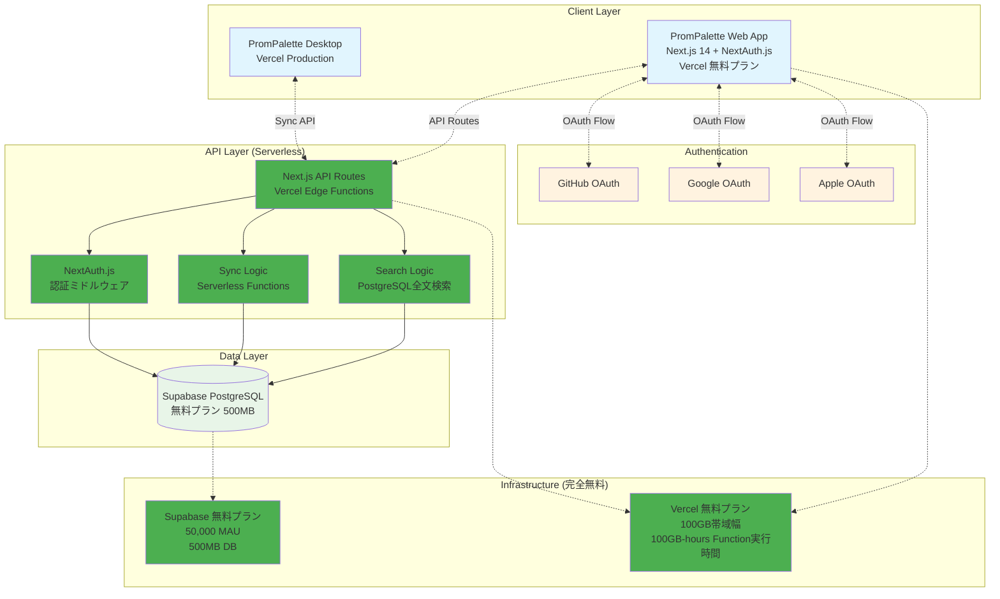
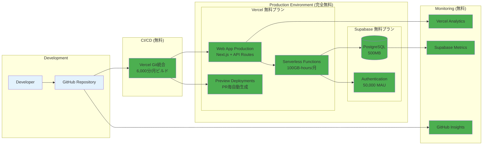
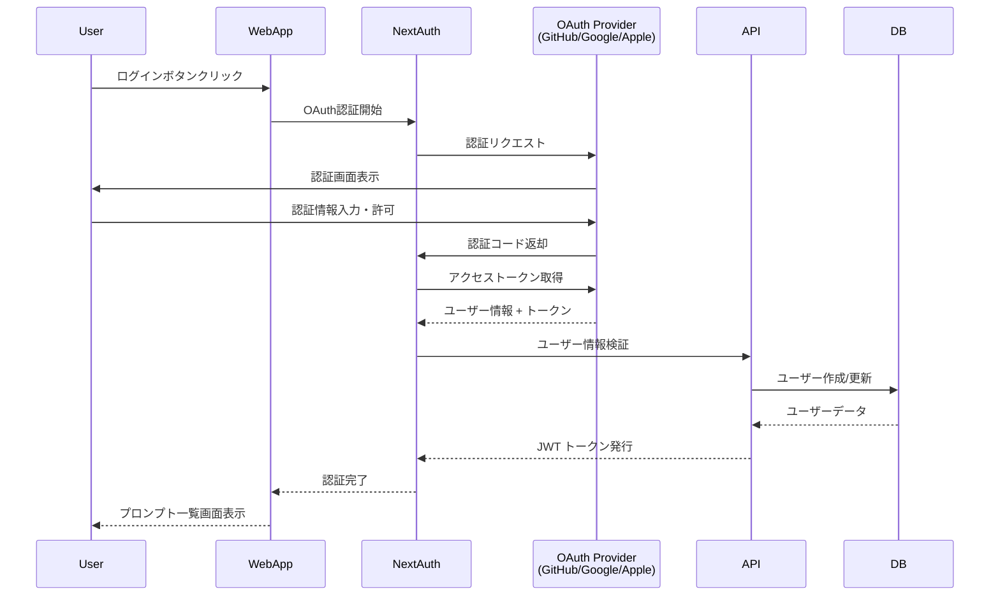
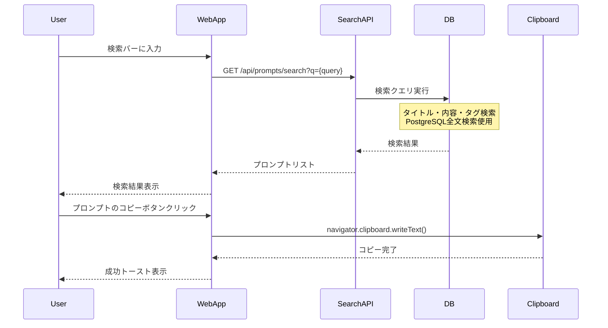
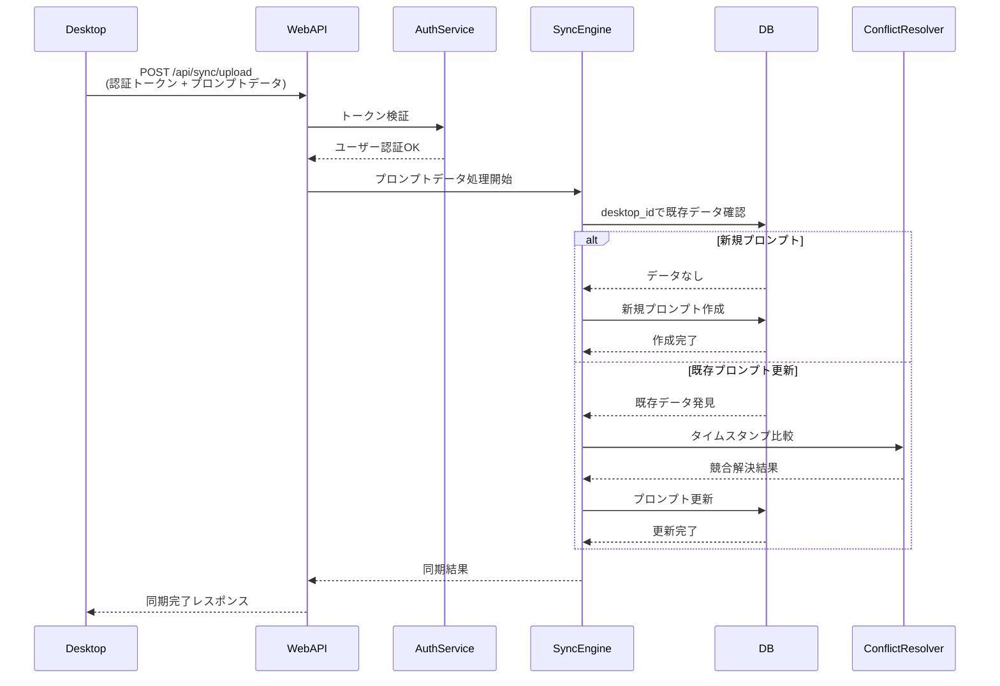
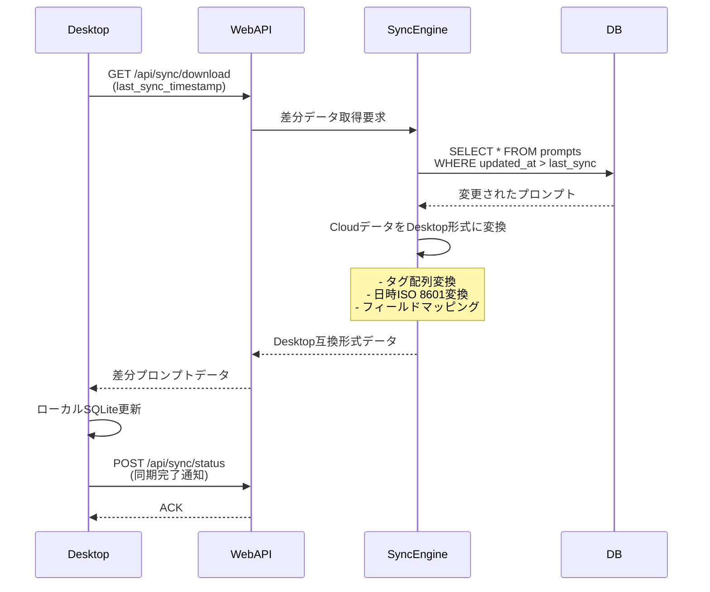
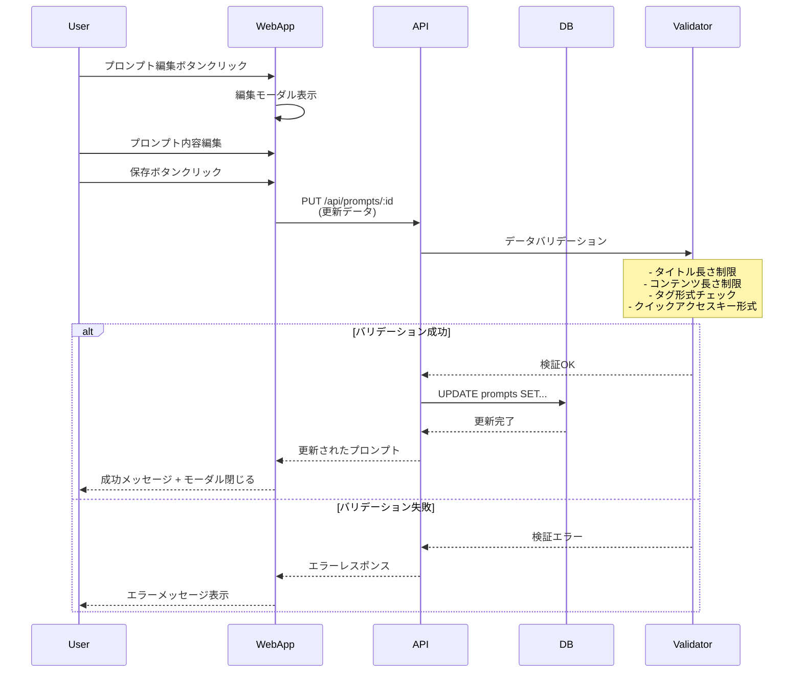
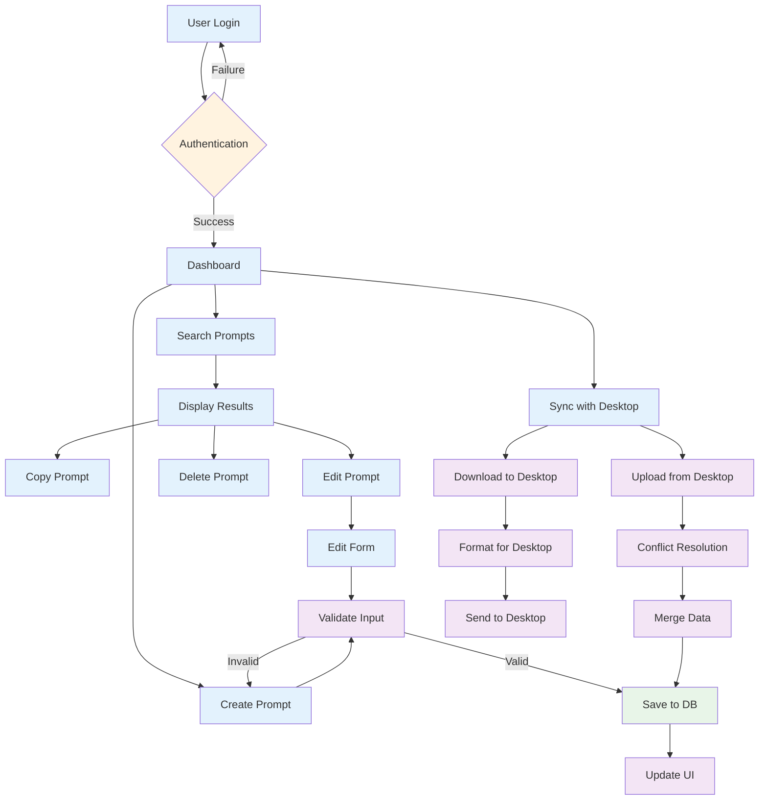

# PromPalette Web App - MVP設計書

**📅 決定日**: 2025-01-13  
**💰 採用構成**: Tier 0（完全無料構成）  
**🎯 開発期間**: 6-7週間  
**💸 運用コスト**: $0/月

## 📋 目標

1. **WebとDesktop間でプロンプトを同期**（完全無料）
2. **公開プロンプトを検索・発見・コピーできる**（Desktop同等性能）
3. **OAuth認証でスムーズにログイン**（企業グレード）
4. **公開プロンプト管理・共有**（プロダクション品質）
5. **高度検索機能**（@username、#tag、複雑なフィルター対応）

## 🏗️ システムアーキテクチャ

### 全体アーキテクチャ図（Tier 0 - 完全無料構成）



### デプロイメント構成図（Tier 0 - 完全無料）



## 📱 機能

### 1. 認証（必須）

- **OAuth認証**: GitHub、Google、Apple
- ログアウト

### 2. 公開プロンプト管理（必須）

- **作成**: 新規プロンプト作成（デフォルト公開）
- **表示**: 公開プロンプト一覧表示・発見
- **編集**: プロンプト内容編集
- **削除**: プロンプト削除
- **高度検索**: @username、#tag、複雑なフィルター対応
- **コピー**: プロンプト内容をクリップボードにコピー
- **統計**: 表示回数・コピー回数の追跡

### 3. Desktop連携（必須）

- **アップロード**: Desktop → Web プロンプト送信
- **ダウンロード**: Web → Desktop プロンプト取得
- **同期**: 双方向でプロンプトを同期

## 🎨 画面

### 1. ログイン画面

- OAuth認証ボタン（GitHub、Google、Apple）
- PromPaletteロゴ・説明

### 2. プロンプト一覧画面（Desktop体験との一貫性重視）

- **ヘッダー**:
  - 検索バー（Desktop同様のリアルタイム検索）
  - 新規作成ボタン
  - 同期ボタン
  - ユーザーメニュー（ログアウト）
- **プロンプトリスト**:
  - プロンプトカード（Desktop風のデザイン）
    - タイトル表示（Desktop同様）
    - 内容プレビュー（最初の2行）
    - タグ表示（Desktopと同じスタイル）
    - クイックアクセスキー表示（あれば）
  - 各カードのアクション:
    - **コピーボタン**（Desktopの「Enter」と同等）
    - **編集ボタン**（Desktopの編集機能と同等）
    - **削除ボタン**（Desktopの削除機能と同等）

### 3. プロンプト編集モーダル（Desktop編集画面と同等機能）

- **タイトル入力**（オプショナル、最大200文字）
- **内容入力**（テキストエリア、最大100,000文字）
- **タグ入力**（カンマ区切り、Desktop同様の入力方式）
- **クイックアクセスキー**（英数字2-20文字、Desktop同様）
- **保存・キャンセルボタン**

### 4. 検索機能（Desktop検索体験の再現）

- **リアルタイム検索**（Desktop同様の即座の絞り込み）
- **検索対象**:
  - タイトル検索
  - 内容の全文検索
  - タグ検索（`#tag`形式）
  - クイックアクセスキー検索（`/key`形式）
- **検索結果ハイライト**（Desktop同様）

## 🗃️ データベース設計

### ER図

```mermaid
erDiagram
    users {
        uuid id PK
        text email UK
        text oauth_provider
        text oauth_id
        text display_name
        text avatar_url
        timestamp created_at
    }

    prompts {
        uuid id PK
        uuid user_id FK
        text title
        text content
        text_array tags
        text quick_access_key
        boolean is_public DEFAULT TRUE
        text visibility DEFAULT 'public'
        integer view_count DEFAULT 0
        integer copy_count DEFAULT 0
        timestamp published_at
        timestamp created_at
        timestamp updated_at
        text desktop_id UK
        timestamp last_synced_at
    }

    sync_sessions {
        uuid id PK
        uuid user_id FK
        text device_type
        timestamp last_sync
        integer sync_count
        text last_error
    }

    users ||--o{ prompts : "owns"
    users ||--o{ sync_sessions : "has"
```

### データモデル詳細

```sql
CREATE TABLE users (
  id UUID PRIMARY KEY,
  email TEXT UNIQUE NOT NULL,
  oauth_provider TEXT NOT NULL,
  oauth_id TEXT NOT NULL,
  display_name TEXT,
  avatar_url TEXT,
  created_at TIMESTAMP NOT NULL
);

CREATE TABLE prompts (
  id UUID PRIMARY KEY,                    -- Desktop互換のUUID v4
  user_id UUID NOT NULL REFERENCES users(id),
  title TEXT,                             -- Desktopと同じ（最大200文字）
  content TEXT NOT NULL,                  -- Desktopと同じ（最大100,000文字）
  tags TEXT[],                           -- PostgreSQL配列型（DesktopのJSON配列と互換）
  quick_access_key TEXT,                 -- Desktopのクイックアクセスキー（英数字2-20文字）
  is_public BOOLEAN DEFAULT TRUE,        -- 公開フラグ（デフォルト公開）
  visibility TEXT DEFAULT 'public' CHECK (visibility IN ('private', 'public', 'unlisted')),
  view_count INTEGER DEFAULT 0,          -- 表示回数
  copy_count INTEGER DEFAULT 0,          -- コピー回数  
  published_at TIMESTAMP,               -- 公開日時
  created_at TIMESTAMP NOT NULL,         -- Desktop互換（UTC）
  updated_at TIMESTAMP NOT NULL,         -- Desktop互換（UTC）
  desktop_id TEXT UNIQUE,                -- Desktop側の元ID（重複防止）
  last_synced_at TIMESTAMP              -- 最終同期日時
  -- ピン留め情報は同期対象外（Desktopローカルのみ）
);

CREATE TABLE sync_sessions (
  id UUID PRIMARY KEY,
  user_id UUID NOT NULL REFERENCES users(id),
  device_type TEXT NOT NULL, -- 'desktop' | 'web'
  last_sync TIMESTAMP NOT NULL,
  sync_count INTEGER DEFAULT 0,
  last_error TEXT
);

-- Desktopデータとの互換性を保つためのインデックス
CREATE INDEX idx_prompts_updated ON prompts(updated_at);
CREATE INDEX idx_prompts_title ON prompts(title);
CREATE INDEX idx_prompts_desktop_id ON prompts(desktop_id);
CREATE INDEX idx_prompts_tags ON prompts USING GIN(tags); -- タグ検索用
CREATE INDEX idx_prompts_content ON prompts USING GIN(to_tsvector('english', content)); -- 全文検索用
```

## 🔌 API設計

### 認証

- `GET /api/auth/signin/{provider}` - OAuth認証
- `POST /api/auth/signout` - ログアウト
- `GET /api/auth/session` - ユーザー情報取得

### 公開プロンプト管理（Desktop体験との一貫性）

- `GET /api/prompts` - 公開プロンプト一覧取得（検索・フィルタパラメータ対応）
- `POST /api/prompts` - プロンプト作成（デフォルト公開、Desktop CreatePromptRequestと互換）
- `PUT /api/prompts/:id` - プロンプト更新（Desktop UpdatePromptRequestと互換）
- `DELETE /api/prompts/:id` - プロンプト削除
- `GET /api/prompts/search?q={query}&scope={scope}&type={type}` - 高度検索
  - `scope=all|mine|public` - 検索スコープ
  - `type=title|content|tags|user` - 検索タイプ
  - 特殊構文: `@username`, `#tag`, `/quickkey` 対応
- `POST /api/prompts/:id/copy` - プロンプトコピー（統計更新）
- `POST /api/prompts/:id/view` - プロンプト表示（統計更新）

### 公開プロンプト発見

- `GET /api/explore/trending` - トレンドプロンプト
- `GET /api/explore/recent` - 最新プロンプト  
- `GET /api/explore/popular` - 人気プロンプト
- `GET /api/explore/tags` - 人気タグ一覧
- `GET /api/explore/users` - アクティブユーザー一覧

### Desktop連携

- `POST /api/sync/upload` - Desktop → Web プロンプトアップロード（完全なDesktopデータ）
- `GET /api/sync/download` - Web → Desktop プロンプトダウンロード
- `POST /api/sync/status` - 同期状況更新
- `POST /api/sync/bulk-upload` - 複数プロンプトの一括アップロード

### Desktopデータアップロード詳細

```typescript
// Desktop → Web アップロード用データ形式（ピン留め情報除外）
interface DesktopPromptUpload {
  id: string; // Desktop側のUUID
  title: string | null; // タイトル（最大200文字）
  content: string; // 本文（最大100,000文字）
  tags: string[]; // タグ配列
  quickAccessKey: string | null; // クイックアクセスキー（英数字2-20文字）
  createdAt: string; // ISO 8601形式の作成日時
  updatedAt: string; // ISO 8601形式の更新日時
  // ピン留め情報は同期せず（Desktopローカルのみ）
}
```

## 🚀 実装計画（Tier 0 - 完全無料構成）

### Phase 0: セットアップ（2日間）- $0/月 🆓

- [ ] Supabase無料アカウント作成
- [ ] Vercel + Supabase統合設定
- [ ] Next.js 14プロジェクト初期化 (API Routes含む)
- [ ] 環境変数設定（開発・本番）

### Phase 1: 認証基盤（1週間）- $0/月 🆓

- [ ] NextAuth.js設定・統合
- [ ] GitHub/Google/Apple OAuth設定
- [ ] Supabase認証テーブル作成
- [ ] 認証フロー実装・テスト
- [ ] 認証状態管理

### Phase 2: プロンプト管理（1.5週間）- $0/月 🆓

- [ ] Supabaseデータベーススキーマ設計・作成
- [ ] Next.js API Routes実装（CRUD）
- [ ] プロンプト一覧画面（Desktop風UI）
- [ ] プロンプト作成・編集モーダル
- [ ] 検索機能（PostgreSQL全文検索）
- [ ] タグ機能・コピー機能

### Phase 3: Desktop同期（1週間）- $0/月 🆓

- [ ] 同期API設計・実装（API Routes）
- [ ] Desktop→Web アップロード
- [ ] Web→Desktop ダウンロード  
- [ ] 競合解決ロジック
- [ ] Desktop側連携コード
- [ ] 同期状況管理

### Phase 4: UI/UX最適化（1週間）- $0/月 🆓

- [ ] Desktop体験との一貫性確保
- [ ] レスポンシブデザイン
- [ ] エラーハンドリング
- [ ] ローディング状態
- [ ] パフォーマンス最適化

### Phase 5: リリース準備（0.5週間）- $0/月 🆓

- [ ] 本番環境設定
- [ ] カスタムドメイン設定
- [ ] Vercel Analytics設定
- [ ] 統合テスト
- [ ] ドキュメント作成

**総期間**: **6-7週間（完全無料）**  
**MVP完成予定**: 2025-03-03

## 🛠️ 技術（Tier 0 - 完全無料構成）

### フロントエンド + バックエンド統合

- **Next.js 14**: App Router + API Routes (統合開発)
- **NextAuth.js**: OAuth認証 (完全無料)
- **Tailwind CSS**: スタイリング
- **SWR**: データフェッチング
- **TypeScript**: 型安全性

### データベース

- **Supabase PostgreSQL**: 無料プラン (500MB, 50K MAU)
- **全文検索**: PostgreSQL GIN インデックス
- **リアルタイム**: Supabase Realtime (将来拡張用)

### 認証プロバイダー（完全無料）

- **GitHub OAuth App**
- **Google OAuth 2.0**
- **Apple Sign In**

### インフラ（完全無料）

- **Vercel**: 統合ホスティング (Frontend + API Routes)
  - 100GB帯域幅/月
  - 100GB-hours Function実行時間/月
  - 6,000分ビルド時間/月
- **Supabase**: データベース + 認証
- **Vercel Git統合**: CI/CD (GitHub Actions不要)

## 📊 成功指標

### 技術指標（無料プランでの目標）

- OAuth認証成功率 > 99% (NextAuth.js)
- 検索レスポンス時間 < 300ms (PostgreSQL全文検索)
- Desktop同期成功率 > 95% (Serverless Functions)
- アプリケーション稼働率 > 99.5% (Vercel Edge)

### ユーザー指標

- OAuth認証完了率 > 80%
- プロンプト作成後の検索利用率 > 60%
- Desktop連携利用率 > 40%
- ユーザー満足度 > 4.5/5 (Desktop同等品質)

## 🔐 セキュリティ（無料プランでも企業グレード）

- **OAuth 2.0/OpenID Connect**: NextAuth.js標準実装
- **HTTPS**: Vercel自動対応 (無料SSL証明書)
- **JWT**: NextAuth.js + Supabase統合
- **CSRF対策**: NextAuth.js標準保護
- **Rate Limiting**: Vercel Edge Functions
- **データ暗号化**: Supabase PostgreSQL標準
- **セッション管理**: NextAuth.js セキュア設定

## 📋 シーケンス図

### 1. OAuth認証フロー



### 2. プロンプト検索・コピーフロー



### 3. Desktop同期フロー（アップロード）



### 4. Desktop同期フロー（ダウンロード）



### 5. プロンプト編集フロー



## 🔄 Desktop連携フロー

### アップロード（Desktop → Web）- データ完全保持

1. **Desktop**: 全プロンプトデータをDesktopPromptUpload形式で準備

   ```typescript
   // Desktopからの完全なデータ
   {
     id: "prompt_12345",
     title: "My Prompt",
     content: "プロンプト内容...",
     tags: ["ai", "productivity"],
     quickAccessKey: "qak1",
     createdAt: "2024-01-01T10:00:00Z",
     updatedAt: "2024-01-13T15:30:00Z",
     pinnedPosition: 1,
     pinnedAt: "2024-01-10T12:00:00Z"
   }
   ```

2. **Desktop**: 認証トークン付きでPOST /api/sync/upload
3. **Web API**: Desktopデータの完全性を検証
   - 全必須フィールドの存在確認
   - データ型・制限値の検証
   - 重複チェック（desktop_idで判定）
4. **Web API**: CloudのpromptsテーブルにDesktopデータを完全保存
   - `desktop_id`にDesktop側のIDを保存
   - 全フィールド（ピン留め情報含む）を保持
5. **Desktop**: 同期完了とCloud側のIDを受信

### ダウンロード（Web → Desktop）- 逆方向同期

1. **Desktop**: 最終同期日時と共にGET /api/sync/download
2. **Web API**: Cloudで変更されたプロンプトを検索
   - `updated_at > last_sync`の条件で抽出
   - Desktop形式に変換して返却
3. **Desktop**: ローカルSQLiteに反映
   - 新規プロンプトは追加
   - 既存プロンプトは更新（競合解決適用）
4. **Desktop**: 同期日時更新

### データ変換処理

```typescript
// Cloud → Desktop変換
function convertCloudToDesktop(cloudPrompt: CloudPrompt): DesktopPrompt {
  return {
    id: cloudPrompt.desktop_id || cloudPrompt.id,
    title: cloudPrompt.title,
    content: cloudPrompt.content,
    tags: cloudPrompt.tags,
    quick_access_key: cloudPrompt.quick_access_key,
    created_at: cloudPrompt.created_at.toISOString(),
    updated_at: cloudPrompt.updated_at.toISOString(),
    pinned_position: cloudPrompt.pinned_position,
    pinned_at: cloudPrompt.pinned_at?.toISOString() || null,
  };
}
```

### 競合解決（シンプル化）

- **タイムスタンプベース**: `updated_at`で最新の更新を優先
- **クイックアクセスキー競合**: 重複時は古い方を削除
- **データ保持**: 同期対象フィールドは完全保持（ピン留め除く）

## 🎨 Desktop体験との一貫性設計

### UI/UX一貫性ポイント

1. **検索体験**:

   - Desktopと同じリアルタイム検索
   - 同じ検索構文（#tag、/key）
   - 同じ検索結果ハイライト

2. **プロンプト表示**:

   - 同じ情報階層（タイトル、プレビュー、タグ）
   - 同じアクションボタン配置

3. **編集機能**:

   - Desktopと同じフィールド構成
   - 同じ入力制限・バリデーション
   - 同じ保存・キャンセルフロー

4. **コピー機能**:
   - Desktop「Enter」= Web「コピーボタン」
   - 同じクリップボード操作
   - 同じ成功フィードバック

### フロントエンド実装詳細

```typescript
// Desktopと互換性のあるプロンプト表示コンポーネント
interface PromptCardProps {
  prompt: {
    id: string;
    title: string | null;
    content: string;
    tags: string[];
    quickAccessKey: string | null;
    createdAt: string;
    updatedAt: string;
  };
  onCopy: (content: string) => void; // Desktop「Enter」と同等
  onEdit: (prompt: Prompt) => void; // Desktop編集と同等
  onDelete: (id: string) => void; // Desktop削除と同等
}

// Desktop検索フックと同等の検索ロジック
function usePromptSearch(prompts: Prompt[], query: string) {
  return useMemo(() => {
    if (!query.trim()) return prompts;

    // Desktopと同じ検索ロジック
    const searchType = query.startsWith('#') ? 'tag' : query.startsWith('/') ? 'quick_key' : 'all';

    return prompts.filter((prompt) => {
      switch (searchType) {
        case 'tag':
          return prompt.tags.some((tag) =>
            tag.toLowerCase().includes(query.slice(1).toLowerCase()),
          );
        case 'quick_key':
          return prompt.quickAccessKey?.toLowerCase().includes(query.slice(1).toLowerCase());
        default:
          return (
            prompt.title?.toLowerCase().includes(query.toLowerCase()) ||
            prompt.content.toLowerCase().includes(query.toLowerCase())
          );
      }
    });
  }, [prompts, query]);
}

// Desktopと同じコピー機能
async function copyPromptToClipboard(content: string) {
  try {
    await navigator.clipboard.writeText(content);
    // Desktopと同じ成功トースト
    showToast('プロンプトをコピーしました', 'success');
  } catch (error) {
    showToast('コピーに失敗しました', 'error');
  }
}
```

## 🔀 データフロー図

### Web App データフロー



### API エンドポイント関係図

```mermaid
graph LR
    subgraph "Client Applications"
        Desktop[Desktop App]
        Web[Web App]
    end

    subgraph "API Endpoints"
        subgraph "Authentication"
            AuthLogin[GET /api/auth/signin/{provider}]
            AuthLogout[POST /api/auth/signout]
            AuthMe[GET /api/auth/session]
        end

        subgraph "Prompts"
            PromptsList[GET /api/prompts]
            PromptsCreate[POST /api/prompts]
            PromptsUpdate[PUT /api/prompts/:id]
            PromptsDelete[DELETE /api/prompts/:id]
            PromptsSearch[GET /api/prompts/search]
            PromptsCopy[POST /api/prompts/:id/copy]
        end

        subgraph "Sync"
            SyncUpload[POST /api/sync/upload]
            SyncDownload[GET /api/sync/download]
            SyncStatus[POST /api/sync/status]
            SyncBulk[POST /api/sync/bulk-upload]
        end
    end

    subgraph "Database"
        Users[(users)]
        Prompts[(prompts)]
        Sessions[(sync_sessions)]
    end

    %% Web App connections
    Web --> AuthLogin
    Web --> AuthLogout
    Web --> AuthMe
    Web --> PromptsList
    Web --> PromptsCreate
    Web --> PromptsUpdate
    Web --> PromptsDelete
    Web --> PromptsSearch
    Web --> PromptsCopy
    Web --> SyncDownload
    Web --> SyncStatus

    %% Desktop App connections
    Desktop --> SyncUpload
    Desktop --> SyncDownload
    Desktop --> SyncStatus
    Desktop --> SyncBulk

    %% Database connections
    AuthLogin --> Users
    AuthMe --> Users
    PromptsList --> Prompts
    PromptsCreate --> Prompts
    PromptsUpdate --> Prompts
    PromptsDelete --> Prompts
    PromptsSearch --> Prompts
    PromptsCopy --> Prompts
    SyncUpload --> Prompts
    SyncDownload --> Prompts
    SyncStatus --> Sessions
    SyncBulk --> Prompts

    classDef client fill:#e1f5fe
    classDef auth fill:#fff3e0
    classDef prompts fill:#f3e5f5
    classDef sync fill:#e8f5e8
    classDef db fill:#fce4ec

    class Desktop,Web client
    class AuthLogin,AuthLogout,AuthMe auth
    class PromptsList,PromptsCreate,PromptsUpdate,PromptsDelete,PromptsSearch,PromptsCopy prompts
    class SyncUpload,SyncDownload,SyncStatus,SyncBulk sync
    class Users,Prompts,Sessions db
```

---

## 💰 コスト・制限情報

### **無料プラン制限**
| 項目 | 制限値 | 実用可能期間 |
|------|--------|-------------|
| **データベース容量** | 500MB | 約5,000-10,000プロンプト |
| **月間アクティブユーザー** | 50,000人 | MVP期間十分 |
| **帯域幅** | 100GB/月 | 約10万ページビュー |
| **Function実行時間** | 100GB-hours/月 | 約100万API呼び出し |
| **プロジェクト数** | 2個 | Dev + Prod環境 |

### **アップグレード必要タイミング**
1. **データベース容量500MB到達** → Supabase Pro ($25/月)
2. **帯域幅100GB/月超過** → Vercel Pro ($20/月) 
3. **月間50,000ユーザー超過** → Supabase Pro必須

**予測**: MVP期間（3-6ヶ月）は完全無料運用可能 🎉

---

**作成日**: 2025-01-13  
**決定事項反映日**: 2025-01-13  
**採用構成**: Tier 0（完全無料構成）  
**更新者**: Claude Code
